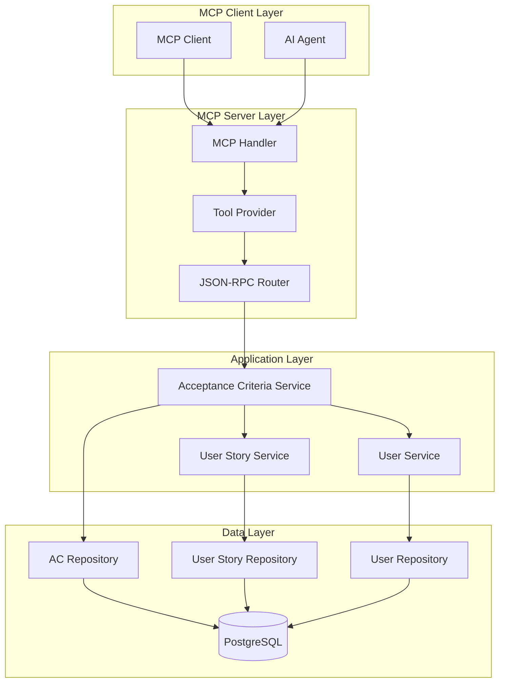

# Design Document

## Overview

This design document outlines the technical implementation for MCP (Model Context Protocol) client functionality to create acceptance criteria for user stories. The system will provide MCP tools that allow AI agents and other MCP clients to programmatically create acceptance criteria with proper validation, linking to user stories, and comprehensive field management.

The implementation follows the existing system architecture patterns and integrates seamlessly with the current MCP infrastructure, providing JSON-RPC 2.0 compliant tools for acceptance criteria management. The design addresses all requirements specified in REQ-036, REQ-037, and US-045, ensuring full compliance with the EARS format requirements and comprehensive error handling.

## Architecture

### High-Level Architecture



### Component Integration

The MCP acceptance criteria management integrates with existing system components:

1. **MCP Infrastructure**: Leverages existing JSON-RPC 2.0 framework and tool provider patterns
2. **Service Layer**: Extends current acceptance criteria service with MCP-specific methods
3. **Repository Layer**: Uses existing repository patterns for data access
4. **Validation Layer**: Implements comprehensive validation following EARS requirements
5. **Authentication**: Integrates with existing JWT-based authentication system

## Components and Interfaces

### MCP Tool Interface

```go
// AcceptanceCriteriaTool implements MCP tool interface for acceptance criteria creation
// Addresses Requirements: REQ-036 (user story identifier resolution), REQ-037 (description validation)
type AcceptanceCriteriaTool struct {
    service service.AcceptanceCriteriaService
    userStoryService service.UserStoryService
    logger *logrus.Logger
}

// Tool definition following MCP specification
type AcceptanceCriteriaToolDefinition struct {
    Name        string                 `json:"name"`
    Description string                 `json:"description"`
    InputSchema AcceptanceCriteriaSchema `json:"inputSchema"`
}

// MCP Tool JSON Schema for acceptance criteria creation
// Implements validation rules from Requirements 1 and 2
var AcceptanceCriteriaToolSchema = map[string]interface{}{
    "type": "object",
    "properties": map[string]interface{}{
        "user_story_id": map[string]interface{}{
            "type":        "string",
            "description": "User story UUID or reference ID (e.g., US-001). Supports both UUID format and reference ID format as per Requirement 1.",
            "pattern":     "^(US-\\d+|[0-9a-f]{8}-[0-9a-f]{4}-[0-9a-f]{4}-[0-9a-f]{4}-[0-9a-f]{12})$",
        },
        "description": map[string]interface{}{
            "type":        "string",
            "description": "Detailed description of the acceptance criteria. Must not be empty and cannot exceed 50000 characters as per Requirement 2.",
            "maxLength":   50000,
            "minLength":   1,
        },
    },
    "required": []string{"user_story_id", "description"},
    "additionalProperties": false,
}
```

### JSON-RPC Request/Response Structures

```go
// MCP tool call request structure
// Implements validation requirements from Requirement 1 and 2
type CreateAcceptanceCriteriaRequest struct {
    UserStoryID string `json:"user_story_id" validate:"required"`
    Description string `json:"description" validate:"required,min=1,max=50000"`
}

// MCP tool call response structure
// Implements Requirement 3 (automatic metadata management) and Requirement 5 (consistent response format)
type CreateAcceptanceCriteriaResponse struct {
    ID          string    `json:"id"`          // Auto-generated UUID
    ReferenceID string    `json:"reference_id"` // Auto-generated AC-XXX format
    UserStoryID string    `json:"user_story_id"` // Resolved from input identifier
    Description string    `json:"description"`   // Preserved exactly as provided
    AuthorID    string    `json:"author_id"`     // Auto-set from authentication context
    CreatedAt   time.Time `json:"created_at"`    // Auto-generated timestamp
    UpdatedAt   time.Time `json:"updated_at"`    // Auto-set to match created_at initially
    
    // Optional populated relationship (when include parameter is used)
    UserStory   *UserStory `json:"user_story,omitempty"`
}

// JSON-RPC error response structure
// Implements Requirement 4 (comprehensive error handling) and Requirement 5 (consistent format)
type MCPErrorResponse struct {
    Code    int         `json:"code"`    // Standard JSON-RPC 2.0 error codes
    Message string      `json:"message"` // Descriptive error message
    Data    interface{} `json:"data,omitempty"` // Additional error context
}
```

### Service Layer Extensions

The MCP tool will use the existing `AcceptanceCriteriaService` and extend `UserStoryService` with reference ID resolution functionality:

```go
// Extended UserStoryService interface for MCP operations
// Implements Requirement 1: Reference ID to UUID resolution with caching
type UserStoryService interface {
    // Existing service methods
    GetByID(id uuid.UUID) (*models.UserStory, error)
    GetByReferenceID(referenceID string) (*models.UserStory, error)
    // ... other existing methods
    
    // New method for MCP reference ID resolution
    GetUUIDByReferenceID(referenceID string) (uuid.UUID, error) // Resolves reference ID to UUID with Redis caching
}

// Extended UserStoryRepository interface for MCP operations
type UserStoryRepository interface {
    // Existing repository methods
    GetByID(id uuid.UUID) (*models.UserStory, error)
    GetByReferenceID(referenceID string) (*models.UserStory, error)
    // ... other existing methods
    
    // New method for efficient UUID resolution
    GetUUIDByReferenceID(referenceID string) (uuid.UUID, error) // Optimized query returning only UUID
}

// UserStoryRepository implementation extension
func (r *userStoryRepository) GetUUIDByReferenceID(referenceID string) (uuid.UUID, error) {
    var userStoryID uuid.UUID
    err := r.db.Model(&models.UserStory{}).
        Select("id").
        Where("reference_id = ?", referenceID).
        First(&userStoryID).Error
    
    if err != nil {
        if errors.Is(err, gorm.ErrRecordNotFound) {
            return uuid.Nil, fmt.Errorf("user story not found")
        }
        return uuid.Nil, err
    }
    
    return userStoryID, nil
}

// UserStoryService implementation extension
func (s *userStoryService) GetUUIDByReferenceID(referenceID string) (uuid.UUID, error) {
    // Try Redis cache first for performance
    cacheKey := fmt.Sprintf("user_story_ref:%s", referenceID)
    if cachedUUID, err := s.redisClient.Get(cacheKey).Result(); err == nil {
        return uuid.Parse(cachedUUID)
    }
    
    // Fallback to repository/database
    userStoryUUID, err := s.repository.GetUUIDByReferenceID(referenceID)
    if err != nil {
        return uuid.Nil, err
    }
    
    // Cache the result for future requests (TTL: 1 hour)
    s.redisClient.Set(cacheKey, userStoryUUID.String(), time.Hour)
    
    return userStoryUUID, nil
}
```

```go
// MCP utility functions for requirement compliance
// These functions will be part of the MCP tool implementation

// ResolveUserStoryIdentifier resolves UUID or reference ID to UUID
// Implements Requirement 1: UUID/Reference ID support with caching
func ResolveUserStoryIdentifier(identifier string, userStoryService service.UserStoryService) (uuid.UUID, error) {
    // Try parsing as UUID first
    if id, err := uuid.Parse(identifier); err == nil {
        return id, nil
    }
    
    // Validate reference ID format (US-XXX)
    if matched, _ := regexp.MatchString(`^US-\d+$`, identifier); !matched {
        return uuid.Nil, fmt.Errorf("invalid user story identifier format")
    }
    
    // Resolve reference ID to UUID using service with caching
    userStoryID, err := userStoryService.GetUUIDByReferenceID(identifier)
    if err != nil {
        return uuid.Nil, fmt.Errorf("user story not found")
    }
    
    return userStoryID, nil
}

// ValidateDescriptionField validates description according to Requirement 2
func ValidateDescriptionField(description string) error {
    if strings.TrimSpace(description) == "" {
        return fmt.Errorf("description is required")
    }
    
    if len(description) > 50000 {
        return fmt.Errorf(ErrMsgDescriptionTooLong)
    }
    
    return nil
}

// ValidateUserStoryReference validates and retrieves user story
// Implements Requirement 1: Reference resolution
func ValidateUserStoryReference(identifier string, userStoryService service.UserStoryService) (*models.UserStory, error) {
    userStoryID, err := ResolveUserStoryIdentifier(identifier, userStoryService)
    if err != nil {
        return nil, err
    }
    
    userStory, err := userStoryService.GetByID(userStoryID)
    if err != nil {
        return nil, fmt.Errorf("user story not found")
    }
    
    return userStory, nil
}
```

## Data Models

### Acceptance Criteria Model 

The existing `AcceptanceCriteria` model will be used:

```go
// AcceptanceCriteria model (uses existing structure)
type AcceptanceCriteria struct {
	ID          uuid.UUID `gorm:"type:uuid;primary_key" json:"id" example:"123e4567-e89b-12d3-a456-426614174000"`                                                                                           // Unique identifier for the acceptance criteria
	ReferenceID string    `gorm:"uniqueIndex;not null" json:"reference_id" example:"AC-001"`                                                                                                                // Human-readable reference identifier
	UserStoryID uuid.UUID `gorm:"not null" json:"user_story_id" example:"123e4567-e89b-12d3-a456-426614174001"`                                                                                             // ID of the parent user story
	AuthorID    uuid.UUID `gorm:"not null" json:"author_id" example:"123e4567-e89b-12d3-a456-426614174002"`                                                                                                 // ID of the user who authored this acceptance criteria
	CreatedAt   time.Time `json:"created_at" example:"2023-01-01T00:00:00Z"`                                                                                                                                // Timestamp when the acceptance criteria was created
	UpdatedAt   time.Time `json:"updated_at" db:"updated_at" example:"2023-01-02T12:30:00Z"`                                                                                                                // Timestamp when the acceptance criteria was last modified
	Description string    `gorm:"not null" json:"description" validate:"required" example:"WHEN a user enters valid credentials THEN the system SHALL authenticate the user and redirect to the dashboard"` // EARS format description of the acceptance criteria

	// Relationships
	UserStory    UserStory     `gorm:"foreignKey:UserStoryID;constraint:OnDelete:CASCADE" json:"user_story,omitempty"`             // Parent user story that this acceptance criteria belongs to
	Author       User          `gorm:"foreignKey:AuthorID;constraint:OnDelete:RESTRICT" json:"author,omitempty"`                   // User who authored this acceptance criteria
	Requirements []Requirement `gorm:"foreignKey:AcceptanceCriteriaID;constraint:OnDelete:SET NULL" json:"requirements,omitempty"` // Requirements linked to this acceptance criteria
	Comments     []Comment     `gorm:"polymorphic:Entity;polymorphicValue:acceptance_criteria" json:"comments,omitempty"`          // Comments associated with this acceptance criteria
}
```

### Database Migration

No database schema changes are required as the existing `AcceptanceCriteria` model already supports all necessary fields for the MCP implementation. The model includes:

- **ID**: UUID primary key (auto-generated, Requirement 3.1)
- **ReferenceID**: Human-readable AC-XXX format (auto-generated, Requirement 3.3)
- **UserStoryID**: Foreign key supporting both UUID and reference ID resolution (Requirement 1)
- **AuthorID**: Set from authentication context (Requirement 3.2)
- **Description**: Text field with 50000 character limit validation (Requirement 2)
- **CreatedAt/UpdatedAt**: Automatic timestamp management (Requirement 3.1, 3.4)

The existing reference ID generation system will automatically handle AC-XXX format generation as specified in Requirement 3.3.

## Error Handling

### JSON-RPC Error Codes

Following JSON-RPC 2.0 specification and MCP conventions as specified in Requirements 4 and 5:

```go
const (
    // Standard JSON-RPC errors (Requirement 5)
    ParseError     = -32700 // Invalid JSON
    InvalidRequest = -32600 // Invalid Request
    MethodNotFound = -32601 // Method not found
    InvalidParams  = -32602 // Invalid params - used for validation and not found errors
    InternalError  = -32603 // Internal error
    
    // Server error range (-32099 to -32000) (Requirement 4)
    ServerErrorUnauthorized = -32001 // Authentication required
    ServerErrorForbidden    = -32002 // Insufficient permissions
)

// Error mapping for acceptance criteria operations
// Implements specific error handling requirements from Requirement 4
var ErrorCodeMap = map[error]int{
    // Requirement 4.2: User story reference resolution errors
    service.ErrUserStoryNotFound:           InvalidParams, // "User story not found"
    service.ErrInvalidUserStoryReference:   InvalidParams, // Invalid reference format
    
    // Requirement 4.1: Validation errors
    service.ErrDescriptionEmpty:            InvalidParams, // Empty description
    service.ErrDescriptionTooLong:          InvalidParams, // Description exceeds 50000 chars
    service.ErrAcceptanceCriteriaNotFound:  InvalidParams,
    
    // Requirement 4.3 & 4.4: Authentication and authorization errors
    auth.ErrUnauthorized:                   ServerErrorUnauthorized, // "Authentication required"
    auth.ErrInsufficientPermissions:        ServerErrorForbidden,    // "Insufficient permissions to create acceptance criteria"
}
```

### Validation Error Handling

```go
// Comprehensive validation error structure
// Implements Requirement 4.1: field-specific validation messages
type ValidationError struct {
    Field   string `json:"field"`
    Message string `json:"message"`
    Code    string `json:"code"`
}

// Validation error response
// Implements Requirement 4.1: JSON-RPC error with field-specific messages
type ValidationErrorResponse struct {
    Code             int                `json:"code"`             // -32602 (Invalid params)
    Message          string             `json:"message"`          // General error message
    ValidationErrors []ValidationError  `json:"validation_errors"` // Field-specific errors
}

// Field-specific validation rules
// Implements validation requirements from Requirements 1 and 2
var ValidationRules = map[string][]ValidationRule{
    "user_story_id": {
        {Type: "required", Message: "User story identifier is required"}, // Requirement 1.5
        {Type: "format", Message: "Must be UUID or reference ID format (US-XXX)"}, // Requirement 1.1, 1.2
        {Type: "exists", Message: "User story not found"}, // Requirement 1.3
    },
    "description": {
        {Type: "required", Message: "Description is required"}, // Requirement 2.2
        {Type: "min_length", Value: 1, Message: "Description cannot be empty"}, // Requirement 2.2
        {Type: "max_length", Value: 50000, Message: "Description exceeds maximum length of 50000 characters"}, // Requirement 2.4
    },
}

// Specific error messages as required by Requirements 1.3 and 2.4
const (
    ErrMsgUserStoryNotFound = "User story not found"
    ErrMsgDescriptionTooLong = "Description exceeds maximum length of 50000 characters"
    ErrMsgAuthenticationRequired = "Authentication required"
    ErrMsgInsufficientPermissions = "Insufficient permissions to create acceptance criteria"
)
```

## Testing Strategy

### Unit Testing

```go
// Test structure for MCP acceptance criteria tool
type AcceptanceCriteriaToolTestSuite struct {
    suite.Suite
    tool    *AcceptanceCriteriaTool
    service *mocks.MockAcceptanceCriteriaService
    userStoryService *mocks.MockUserStoryService
    logger  *logrus.Logger
}

// Test cases covering all requirements
func (suite *AcceptanceCriteriaToolTestSuite) TestCreateAcceptanceCriteria_Success() {
    // Test successful creation with UUID
    // Test successful creation with reference ID
    // Test all required fields validation
    // Test character limits for description
}

func (suite *AcceptanceCriteriaToolTestSuite) TestCreateAcceptanceCriteria_ValidationErrors() {
    // Test missing required fields
    // Test invalid user story identifier
    // Test description field length limits
}

func (suite *AcceptanceCriteriaToolTestSuite) TestCreateAcceptanceCriteria_AuthenticationErrors() {
    // Test missing authentication
    // Test insufficient permissions
}
```

### Integration Testing

No new integration tests needed

### MCP Protocol Testing

```go
// Test MCP protocol compliance
func TestMCPProtocolCompliance(t *testing.T) {
    // Test JSON-RPC 2.0 format compliance
    // Test tool discovery via tools/list
    // Test tool execution via tools/call
    // Test error response format
    // Test authentication integration
}
```

## Security Considerations

### Authentication and Authorization

The MCP acceptance criteria tool will use the existing authentication infrastructure without requiring additional middleware or authentication code:

**Existing Authentication Pattern:**
- MCP routes use `auth.PATMiddleware(authService, patService)` which supports Personal Access Token (PAT) 
- The middleware automatically validates tokens and sets user context in Gin context
- User information is accessible via `auth.GetCurrentUserID(c)` and `auth.GetUserFromContext(c)`

**Integration with Existing System:**
```go
// The MCP tool will extract user context using existing patterns
// Implements Requirements 3.2 (automatic author_id setting) and 4.3/4.4 (authentication errors)
func (t *AcceptanceCriteriaTool) CreateAcceptanceCriteria(ctx context.Context, params map[string]interface{}) (interface{}, error) {
    // Extract user ID from Gin context (set by existing PATMiddleware)
    userID, ok := auth.GetCurrentUserID(ginContext)
    if !ok {
        // Requirement 4.3: Return specific error message for authentication failure
        return nil, jsonrpc.NewError(jsonrpc.ServerErrorUnauthorized, ErrMsgAuthenticationRequired, nil)
    }
    
    // Validate user permissions for acceptance criteria creation
    if !auth.HasPermission(ginContext, "create_acceptance_criteria") {
        // Requirement 4.4: Return specific error message for insufficient permissions
        return nil, jsonrpc.NewError(jsonrpc.ServerErrorForbidden, ErrMsgInsufficientPermissions, nil)
    }
    
    // Parse and validate input parameters
    userStoryIdentifier := params["user_story_id"].(string)
    description := params["description"].(string)
    
    // Validate description using utility function
    if err := ValidateDescriptionField(description); err != nil {
        return nil, jsonrpc.NewError(jsonrpc.InvalidParams, err.Error(), nil)
    }
    
    // Resolve user story identifier using utility function (with Redis caching)
    userStoryID, err := ResolveUserStoryIdentifier(userStoryIdentifier, t.userStoryService)
    if err != nil {
        return nil, jsonrpc.NewError(jsonrpc.InvalidParams, err.Error(), nil)
    }
    
    // Use existing service layer with authenticated user ID
    // Implements Requirement 3.2: automatic author_id setting
    req := service.CreateAcceptanceCriteriaRequest{
        UserStoryID: userStoryID,
        AuthorID:    uuid.MustParse(userID), // Auto-set from authentication context
        Description: description,
    }
    
    return t.service.CreateAcceptanceCriteria(req)
}
```

**No Additional Authentication Code Required:**
- Leverages existing `auth.PATMiddleware` from routes.go
- Uses existing `auth.GetCurrentUserID()` helper function
- Integrates with existing JWT and PAT token validation
- Follows established authentication patterns used by other MCP tools

### Input Validation and Sanitization

```go
// Comprehensive input validation
// Implements validation requirements from Requirements 1, 2, and 4
type InputValidator struct {
    validator *validator.Validate
}

// Validate and sanitize MCP request
// Implements all validation rules from Requirements 1 and 2
func (v *InputValidator) ValidateCreateRequest(req *CreateAcceptanceCriteriaRequest) error {
    // Requirement 1.5: Validate user story identifier is not empty or null
    if strings.TrimSpace(req.UserStoryID) == "" {
        return fmt.Errorf("user story identifier is required")
    }
    
    // Requirement 1.1, 1.2: Validate user story identifier format (UUID or US-XXX)
    if !v.isValidUserStoryIdentifier(req.UserStoryID) {
        return fmt.Errorf("must be UUID or reference ID format (US-XXX)")
    }
    
    // Requirement 2.2: Validate description is not empty or null
    if strings.TrimSpace(req.Description) == "" {
        return fmt.Errorf("description is required")
    }
    
    // Requirement 2.3, 2.4: Validate description length (max 50000 characters)
    if len(req.Description) > 50000 {
        return fmt.Errorf(ErrMsgDescriptionTooLong)
    }
    
    return nil
}

// Validate user story identifier format (UUID or US-XXX)
func (v *InputValidator) isValidUserStoryIdentifier(identifier string) bool {
    // Check UUID format
    if _, err := uuid.Parse(identifier); err == nil {
        return true
    }
    
    // Check US-XXX reference ID format
    matched, _ := regexp.MatchString(`^US-\d+$`, identifier)
    return matched
}

// Sanitize text inputs
// Implements Requirement 2.5: preserve exact formatting and content
func (v *InputValidator) SanitizeTextInput(input string) string {
    // Requirement 2.5: Preserve the exact formatting and content of the provided description
    // Only remove null bytes and other control characters that could cause issues
    return strings.ReplaceAll(input, "\x00", "")
}
```


## Implementation Plan

### Phase 1: Core MCP Tool Implementation

1. **MCP Tool Structure**
   - Implement `AcceptanceCriteriaTool` following existing patterns
   - Define JSON schema for tool parameters with validation rules from Requirements 1 and 2
   - Implement tool discovery and execution methods with JSON-RPC 2.0 compliance (Requirement 5)

2. **Service Layer Extensions**
   - Use existing `AcceptanceCriteriaService` without modifications
   - Extend `UserStoryService` with `GetUUIDByReferenceID` method for cached reference ID resolution (Requirement 1)
   - Implement MCP utility functions for user story identifier resolution supporting both UUID and reference ID formats (Requirement 1)
   - Add validation utility functions for description field constraints (Requirement 2)

3. **Request/Response Handling**
   - Implement JSON-RPC 2.0 compliant request parsing (Requirement 5)
   - Create structured response formatting with all auto-generated fields (Requirement 3)
   - Implement error mapping and response generation with specific error codes and messages (Requirement 4)

### Phase 2: Validation and Error Handling

1. **Input Validation**
   - Implement field-level validation rules as specified in Requirements 1 and 2
   - Add format validation for user story identifiers (UUID and US-XXX patterns)
   - Implement character limit enforcement (1-50000 characters for description)

2. **Error Response System**
   - Map service errors to JSON-RPC error codes (-32602 for validation, -32001 for auth)
   - Implement detailed error messages matching requirement specifications
   - Add validation error aggregation with field-specific feedback (Requirement 4.1)

3. **Authentication Integration**
   - Integrate with existing PAT authentication middleware
   - Implement user context extraction for automatic author_id setting (Requirement 3.2)
   - Add authorization checks with specific error messages (Requirements 4.3, 4.4)

### Phase 3: Database and Model Integration

1. **Model Integration**
   - Use existing `AcceptanceCriteria` model without modifications
   - Leverage existing reference ID generation system for AC-XXX format (Requirement 3.3)
   - Ensure automatic timestamp management (Requirements 3.1, 3.4)

2. **Repository Updates**
   - Add optimized queries for MCP operations
   - Extend `UserStoryRepository` with `GetUUIDByReferenceID` method for efficient reference ID to UUID resolution (Requirement 1)
   - Implement database query optimization for reference ID lookups
   - Enhance user story lookup capabilities supporting both UUID and reference ID

3. **Reference ID Generation**
   - Integrate with existing PostgreSQL-based reference ID system
   - Ensure thread-safe generation for acceptance criteria with AC- prefix
   - Add proper error handling for ID conflicts

### Phase 4: Testing and Integration

1. **Unit Testing**
   - Comprehensive test coverage for all validation scenarios from Requirements 1-5
   - Mock-based testing for service layer with error condition testing
   - Validation rule testing for all field constraints and error messages

### Design Rationale

**Key Design Decisions:**

1. **Reuse Existing Infrastructure**: The design leverages existing MCP infrastructure, authentication middleware, and reference ID generation to minimize implementation complexity and ensure consistency.

2. **Comprehensive Validation**: All validation requirements are implemented at multiple layers (JSON schema, service layer, and database constraints) to ensure data integrity and provide clear error feedback.

3. **Error Code Mapping**: Specific JSON-RPC error codes are mapped to different error conditions as required, with -32602 for validation errors and -32001/-32002 for authentication/authorization issues.

4. **Automatic Metadata Management**: The design ensures all metadata fields (ID, reference_id, author_id, timestamps) are automatically managed without client intervention, as specified in Requirement 3.

5. **Flexible Identifier Support**: The system supports both UUID and human-readable reference IDs for user stories, making it easier for MCP clients to work with the API without needing to know internal UUID formats.

## Deployment Considerations


### Monitoring and Logging

The MCP acceptance criteria tool will integrate with existing monitoring and logging infrastructure:

**Existing Infrastructure Integration:**
- Uses existing `logrus.Logger` instance passed to the tool
- Leverages existing structured logging patterns used by other MCP tools
- Integrates with existing error tracking and monitoring systems
- Follows established logging conventions for MCP operations

**Implementation Approach:**
- Reuse existing logger configuration and formatting
- Follow existing error handling and logging patterns from other MCP tools
- Integrate with existing metrics collection if available
- Use existing correlation ID and request tracking mechanisms

This design provides a comprehensive foundation for implementing MCP acceptance criteria management functionality while maintaining consistency with existing system architecture and ensuring robust error handling, security, and performance. The design fully addresses all requirements specified in REQ-036, REQ-037, and US-045, with particular attention to:

- **Requirement Compliance**: Each design component is explicitly mapped to specific requirements
- **Error Handling**: Comprehensive error scenarios with exact error codes and messages as specified
- **Validation**: Multi-layer validation ensuring data integrity and user feedback
- **Authentication**: Seamless integration with existing authentication infrastructure
- **Metadata Management**: Automatic handling of all system-generated fields
- **Response Consistency**: JSON-RPC 2.0 compliant responses with optional relationship inclusion

The implementation will provide MCP clients with a robust, well-validated tool for creating acceptance criteria while maintaining the system's architectural integrity and security standards.