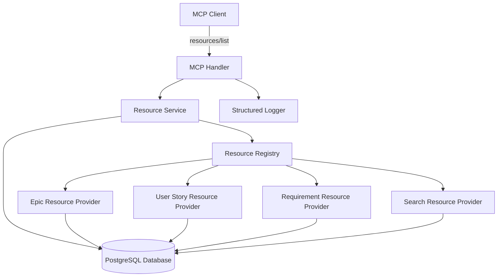
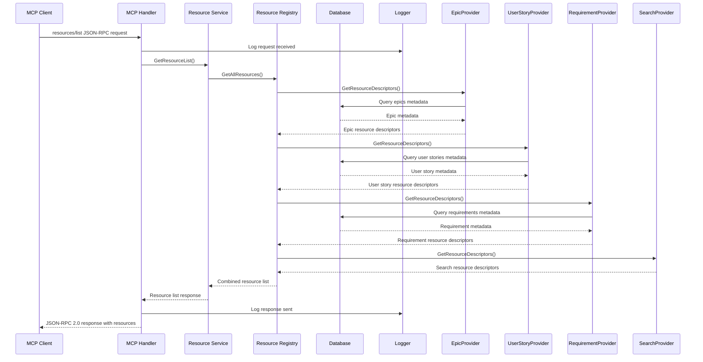

# MCP Resources List Method - Design Document

## Overview

This document outlines the technical design for implementing the `resources/list` method in the MCP (Model Context Protocol) server. The implementation will enable MCP clients to discover available resources from the requirements management system, providing structured access to epics, user stories, requirements, acceptance criteria, and hierarchical views.

The design follows the MCP specification for the resources primitive, ensuring compatibility with standard MCP clients while leveraging the existing Go-based requirements management system architecture.

**Epic Reference:** [EP-204: MCP Resources List Method Implementation](https://requirements-system/epics/EP-204)

## Architecture

### High-Level Architecture



### Request/Response Flow



## Components and Interfaces

### 1. MCP Handler Extension

#### Resource List Handler (internal/handlers/mcp_handler.go)
```go
// Add to existing MCPHandler struct
type MCPHandler struct {
    // ... existing fields
    resourceService *service.ResourceService
}

// Add new method to handle resources/list
func (h *MCPHandler) handleResourcesList(ctx context.Context, req *jsonrpc.Request) (*jsonrpc.Response, error) {
    h.logger.WithFields(logrus.Fields{
        "method": "resources/list",
        "id":     req.ID,
    }).Info("Processing resources/list request")
    
    resources, err := h.resourceService.GetResourceList(ctx)
    if err != nil {
        h.logger.WithError(err).Error("Failed to get resource list")
        return jsonrpc.NewErrorResponse(req.ID, jsonrpc.InternalError, "Failed to retrieve resources"), nil
    }
    
    result := map[string]interface{}{
        "resources": resources,
    }
    
    h.logger.WithField("resource_count", len(resources)).Info("Resources list retrieved successfully")
    return jsonrpc.NewResponse(req.ID, result), nil
}
```

### 2. Resource Service Layer

#### Resource Service Interface (internal/service/resource_service.go)
```go
type ResourceService interface {
    GetResourceList(ctx context.Context) ([]ResourceDescriptor, error)
}

type ResourceServiceImpl struct {
    registry ResourceRegistry
    logger   *logrus.Logger
}

type ResourceDescriptor struct {
    URI         string `json:"uri"`
    Name        string `json:"name"`
    Description string `json:"description,omitempty"`
    MimeType    string `json:"mimeType"`
}

func (s *ResourceServiceImpl) GetResourceList(ctx context.Context) ([]ResourceDescriptor, error) {
    resources, err := s.registry.GetAllResources(ctx)
    if err != nil {
        return nil, fmt.Errorf("failed to get resources from registry: %w", err)
    }
    
    // Sort resources for consistent ordering
    sort.Slice(resources, func(i, j int) bool {
        return resources[i].URI < resources[j].URI
    })
    
    return resources, nil
}
```

### 3. Resource Registry

#### Resource Registry Interface (internal/service/resource_registry.go)
```go
type ResourceRegistry interface {
    GetAllResources(ctx context.Context) ([]ResourceDescriptor, error)
    RegisterProvider(provider ResourceProvider)
}

type ResourceProvider interface {
    GetResourceDescriptors(ctx context.Context) ([]ResourceDescriptor, error)
    GetProviderName() string
}

type ResourceRegistryImpl struct {
    providers []ResourceProvider
    logger    *logrus.Logger
}

func (r *ResourceRegistryImpl) GetAllResources(ctx context.Context) ([]ResourceDescriptor, error) {
    var allResources []ResourceDescriptor
    
    for _, provider := range r.providers {
        resources, err := provider.GetResourceDescriptors(ctx)
        if err != nil {
            r.logger.WithError(err).WithField("provider", provider.GetProviderName()).
                Error("Failed to get resources from provider")
            continue // Continue with other providers
        }
        allResources = append(allResources, resources...)
    }
    
    return allResources, nil
}

func (r *ResourceRegistryImpl) RegisterProvider(provider ResourceProvider) {
    r.providers = append(r.providers, provider)
    r.logger.WithField("provider", provider.GetProviderName()).Info("Resource provider registered")
}
```

### 4. Resource Providers

#### Epic Resource Provider (internal/service/epic_resource_provider.go)
```go
type EpicResourceProvider struct {
    epicRepo repository.EpicRepository
    logger   *logrus.Logger
}

func (p *EpicResourceProvider) GetResourceDescriptors(ctx context.Context) ([]ResourceDescriptor, error) {
    epics, _, err := p.epicRepo.GetAll(ctx, 1000, 0) // Get reasonable limit
    if err != nil {
        return nil, fmt.Errorf("failed to get epics: %w", err)
    }
    
    var resources []ResourceDescriptor
    
    // Add individual epic resources
    for _, epic := range epics {
        resources = append(resources, ResourceDescriptor{
            URI:         fmt.Sprintf("requirements://epics/%s", epic.ID),
            Name:        fmt.Sprintf("Epic: %s", epic.Title),
            Description: fmt.Sprintf("Epic %s: %s", epic.ReferenceID, epic.Title),
            MimeType:    "application/json",
        })
    }
    
    // Add epics collection resource
    resources = append(resources, ResourceDescriptor{
        URI:         "requirements://epics",
        Name:        "All Epics",
        Description: "Complete list of all epics in the system",
        MimeType:    "application/json",
    })
    
    return resources, nil
}

func (p *EpicResourceProvider) GetProviderName() string {
    return "epic_provider"
}
```

#### User Story Resource Provider (internal/service/user_story_resource_provider.go)
```go
type UserStoryResourceProvider struct {
    userStoryRepo repository.UserStoryRepository
    logger        *logrus.Logger
}

func (p *UserStoryResourceProvider) GetResourceDescriptors(ctx context.Context) ([]ResourceDescriptor, error) {
    userStories, _, err := p.userStoryRepo.GetAll(ctx, 1000, 0)
    if err != nil {
        return nil, fmt.Errorf("failed to get user stories: %w", err)
    }
    
    var resources []ResourceDescriptor
    
    // Add individual user story resources
    for _, us := range userStories {
        resources = append(resources, ResourceDescriptor{
            URI:         fmt.Sprintf("requirements://user-stories/%s", us.ID),
            Name:        fmt.Sprintf("User Story: %s", us.Title),
            Description: fmt.Sprintf("User Story %s: %s", us.ReferenceID, us.Title),
            MimeType:    "application/json",
        })
    }
    
    // Add user stories collection resource
    resources = append(resources, ResourceDescriptor{
        URI:         "requirements://user-stories",
        Name:        "All User Stories",
        Description: "Complete list of all user stories in the system",
        MimeType:    "application/json",
    })
    
    return resources, nil
}

func (p *UserStoryResourceProvider) GetProviderName() string {
    return "user_story_provider"
}
```

#### Requirement Resource Provider (internal/service/requirement_resource_provider.go)
```go
type RequirementResourceProvider struct {
    requirementRepo repository.RequirementRepository
    logger          *logrus.Logger
}

func (p *RequirementResourceProvider) GetResourceDescriptors(ctx context.Context) ([]ResourceDescriptor, error) {
    requirements, _, err := p.requirementRepo.GetAll(ctx, 1000, 0)
    if err != nil {
        return nil, fmt.Errorf("failed to get requirements: %w", err)
    }
    
    var resources []ResourceDescriptor
    
    // Add individual requirement resources
    for _, req := range requirements {
        resources = append(resources, ResourceDescriptor{
            URI:         fmt.Sprintf("requirements://requirements/%s", req.ID),
            Name:        fmt.Sprintf("Requirement: %s", req.Title),
            Description: fmt.Sprintf("Requirement %s: %s", req.ReferenceID, req.Title),
            MimeType:    "application/json",
        })
    }
    
    // Add requirements collection resource
    resources = append(resources, ResourceDescriptor{
        URI:         "requirements://requirements",
        Name:        "All Requirements",
        Description: "Complete list of all requirements in the system",
        MimeType:    "application/json",
    })
    
    return resources, nil
}

func (p *RequirementResourceProvider) GetProviderName() string {
    return "requirement_provider"
}
```


#### Search Resource Provider (internal/service/search_resource_provider.go)
```go
type SearchResourceProvider struct {
    logger *logrus.Logger
}

func (p *SearchResourceProvider) GetResourceDescriptors(ctx context.Context) ([]ResourceDescriptor, error) {
    return []ResourceDescriptor{
        {
            URI:         "requirements://search/{query}",
            Name:        "Search Requirements",
            Description: "Search across all epics, user stories, and requirements",
            MimeType:    "application/json",
        },
    }, nil
}

func (p *SearchResourceProvider) GetProviderName() string {
    return "search_provider"
}
```

## Data Models

### Resource Descriptor Schema
```go
type ResourceDescriptor struct {
    URI         string `json:"uri"`         // Unique resource identifier
    Name        string `json:"name"`        // Human-readable name
    Description string `json:"description,omitempty"` // Optional description
    MimeType    string `json:"mimeType"`    // Content type (application/json)
}
```

### JSON-RPC Response Format
```json
{
    "jsonrpc": "2.0",
    "id": 1,
    "result": {
        "resources": [
            {
                "uri": "requirements://epics/bc77e43b-5378-463d-bdee-4db539e5d189",
                "name": "Epic: MCP Resources List Method Implementation",
                "description": "Epic EP-204: MCP Resources List Method Implementation",
                "mimeType": "application/json"
            },
            {
                "uri": "requirements://search/{query}",
                "name": "Search Requirements",
                "description": "Search across all epics, user stories, and requirements",
                "mimeType": "application/json"
            }
        ]
    }
}
```

### URI Scheme Design

#### Individual Entity Resources
- **Epics**: `requirements://epics/{uuid}`
- **User Stories**: `requirements://user-stories/{uuid}`
- **Requirements**: `requirements://requirements/{uuid}`
- **Acceptance Criteria**: `requirements://acceptance-criteria/{uuid}`

#### Collection Resources
- **All Epics**: `requirements://epics`
- **All User Stories**: `requirements://user-stories`
- **All Requirements**: `requirements://requirements`
- **All Acceptance Criteria**: `requirements://acceptance-criteria`

#### Special Resources
- **Search Template**: `requirements://search/{query}`

## Error Handling

### Error Types and Codes
```go
const (
    // MCP-specific error codes
    MCPInternalError     = -32603 // JSON-RPC internal error
    MCPInvalidRequest    = -32600 // JSON-RPC invalid request
    MCPMethodNotFound    = -32601 // JSON-RPC method not found
    MCPInvalidParams     = -32602 // JSON-RPC invalid params
    
    // Application-specific error codes
    DatabaseError        = -32001 // Database connection/query error
    AuthenticationError  = -32002 // Authentication failure
    ResourceNotFound     = -32003 // Resource not found
)
```

### Error Response Format
```json
{
    "jsonrpc": "2.0",
    "id": 1,
    "error": {
        "code": -32603,
        "message": "Internal error",
        "data": {
            "details": "Database connection failed"
        }
    }
}
```

### Error Handling Strategy
```go
func (h *MCPHandler) handleError(req *jsonrpc.Request, err error, context string) *jsonrpc.Response {
    h.logger.WithError(err).WithField("context", context).Error("Request processing failed")
    
    switch {
    case errors.Is(err, gorm.ErrRecordNotFound):
        return jsonrpc.NewErrorResponse(req.ID, ResourceNotFound, "Resource not found")
    case isDBError(err):
        return jsonrpc.NewErrorResponse(req.ID, DatabaseError, "Database error occurred")
    case isAuthError(err):
        return jsonrpc.NewErrorResponse(req.ID, AuthenticationError, "Authentication failed")
    default:
        return jsonrpc.NewErrorResponse(req.ID, MCPInternalError, "Internal server error")
    }
}
```

## Testing Strategy

### Unit Tests
```go
// Test resource service
func TestResourceService_GetResourceList(t *testing.T) {
    // Test successful resource retrieval
    // Test error handling from providers
    // Test resource sorting
}

// Test resource providers
func TestEpicResourceProvider_GetResourceDescriptors(t *testing.T) {
    // Test epic resource generation
    // Test database error handling
    // Test empty result handling
}

// Test resource registry
func TestResourceRegistry_GetAllResources(t *testing.T) {
    // Test provider registration
    // Test resource aggregation
    // Test partial failure handling
}
```

### Integration Tests
```go
func TestMCPHandler_ResourcesList_Integration(t *testing.T) {
    // Test complete request/response cycle
    // Test with real database
    // Test JSON-RPC compliance
    // Test error scenarios
}
```

### MCP Compliance Tests
```go
func TestResourcesList_MCPCompliance(t *testing.T) {
    // Test JSON-RPC 2.0 format
    // Test MCP resource schema
    // Test method name compliance
    // Test parameter handling
}
```

## Performance Considerations

### Database Optimization
- **Pagination**: Limit resource queries to reasonable sizes (1000 items per provider)
- **Indexing**: Ensure proper indexes on frequently queried fields
- **Connection Pooling**: Reuse database connections efficiently
- **Query Optimization**: Use efficient queries for metadata retrieval

### Caching Strategy
```go
type CachedResourceService struct {
    underlying ResourceService
    cache      *cache.Cache
    ttl        time.Duration
}

func (s *CachedResourceService) GetResourceList(ctx context.Context) ([]ResourceDescriptor, error) {
    cacheKey := "resources:list"
    
    if cached, found := s.cache.Get(cacheKey); found {
        return cached.([]ResourceDescriptor), nil
    }
    
    resources, err := s.underlying.GetResourceList(ctx)
    if err != nil {
        return nil, err
    }
    
    s.cache.Set(cacheKey, resources, s.ttl)
    return resources, nil
}
```

### Memory Management
- **Resource Limits**: Implement reasonable limits on resource counts
- **Streaming**: Consider streaming for very large resource lists
- **Garbage Collection**: Ensure proper cleanup of temporary objects

## Security Considerations

### Authentication Integration
```go
func (h *MCPHandler) handleResourcesList(ctx context.Context, req *jsonrpc.Request) (*jsonrpc.Response, error) {
    // Extract user context from authentication
    userID, ok := ctx.Value("user_id").(string)
    if !ok {
        return h.handleError(req, errors.New("authentication required"), "resources/list")
    }
    
    // Pass user context to service for authorization
    resources, err := h.resourceService.GetResourceListForUser(ctx, userID)
    // ... rest of implementation
}
```

### Data Filtering
- **User Permissions**: Filter resources based on user access rights
- **Sensitive Data**: Exclude sensitive information from resource descriptors
- **Rate Limiting**: Implement rate limiting for resource list requests

## Deployment and Configuration

### Service Registration
```go
func SetupResourceService(db *gorm.DB, logger *logrus.Logger) *service.ResourceServiceImpl {
    registry := &service.ResourceRegistryImpl{
        providers: make([]service.ResourceProvider, 0),
        logger:    logger,
    }
    
    // Register all providers
    registry.RegisterProvider(&service.EpicResourceProvider{
        epicRepo: repository.NewEpicRepository(db),
        logger:   logger,
    })
    
    registry.RegisterProvider(&service.UserStoryResourceProvider{
        userStoryRepo: repository.NewUserStoryRepository(db),
        logger:        logger,
    })
    
    registry.RegisterProvider(&service.RequirementResourceProvider{
        requirementRepo: repository.NewRequirementRepository(db),
        logger:          logger,
    })
    

    
    registry.RegisterProvider(&service.SearchResourceProvider{
        logger: logger,
    })
    
    return &service.ResourceServiceImpl{
        registry: registry,
        logger:   logger,
    }
}
```

### Configuration Options
```go
type ResourceConfig struct {
    MaxResourcesPerProvider int           `yaml:"max_resources_per_provider"`
    CacheTTL               time.Duration `yaml:"cache_ttl"`
    EnableCaching          bool          `yaml:"enable_caching"`
    LogLevel               string        `yaml:"log_level"`
}
```

## Migration and Rollback

### Backward Compatibility
- The implementation is additive and doesn't modify existing functionality
- Existing MCP methods continue to work unchanged
- No database schema changes required

### Rollback Strategy
- Feature can be disabled by removing the method handler registration
- No data migration required for rollback
- Graceful degradation if resource providers fail

## Monitoring and Observability

### Metrics
```go
var (
    resourceListRequests = prometheus.NewCounterVec(
        prometheus.CounterOpts{
            Name: "mcp_resources_list_requests_total",
            Help: "Total number of resources/list requests",
        },
        []string{"status"},
    )
    
    resourceListDuration = prometheus.NewHistogramVec(
        prometheus.HistogramOpts{
            Name: "mcp_resources_list_duration_seconds",
            Help: "Duration of resources/list requests",
        },
        []string{"provider"},
    )
)
```

### Logging
```go
func (h *MCPHandler) handleResourcesList(ctx context.Context, req *jsonrpc.Request) (*jsonrpc.Response, error) {
    start := time.Now()
    
    h.logger.WithFields(logrus.Fields{
        "method":     "resources/list",
        "request_id": req.ID,
        "timestamp":  start,
    }).Info("Processing resources/list request")
    
    defer func() {
        duration := time.Since(start)
        h.logger.WithFields(logrus.Fields{
            "method":     "resources/list",
            "request_id": req.ID,
            "duration":   duration,
        }).Info("Completed resources/list request")
    }()
    
    // ... implementation
}
```

This design provides a comprehensive, scalable, and maintainable implementation of the MCP `resources/list` method that integrates seamlessly with the existing requirements management system architecture.