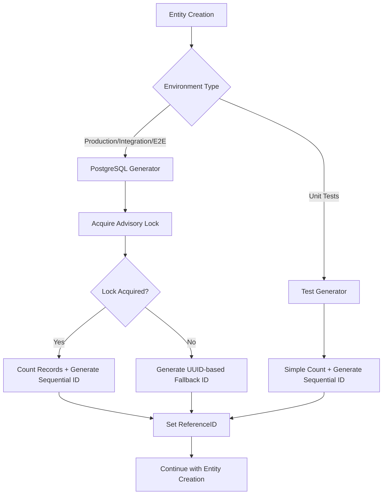

# Design Document

## Overview

This design document outlines the approach to standardize ReferenceID generation across all entities in the product requirements management system. The solution will implement a unified strategy that ensures thread-safety, handles concurrency properly, and provides consistent behavior across all entity types.

## Architecture

### Current Architecture Issues

The current implementation has two different approaches:
1. **Sophisticated Approach** (Epic, UserStory): PostgreSQL advisory locks with UUID fallback
2. **Basic Approach** (Requirement, AcceptanceCriteria): Simple count-based generation

This creates inconsistency and potential race conditions.

### Target Architecture



### Static Generator Selection Design

Use compile-time selection of generators based on context:

```go
// Production generator (used in production, integration, e2e tests)
type PostgreSQLReferenceIDGenerator struct {
    lockKey int64
    prefix  string
}

// Test generator (only available in unit test files)
type TestReferenceIDGenerator struct {
    prefix string
}

// Common interface
type ReferenceIDGenerator interface {
    Generate(tx *gorm.DB, model interface{}) (string, error)
}
```

## Components and Interfaces

### 1. Production Reference ID Generator

**Location**: `internal/models/reference_id.go`

**Purpose**: PostgreSQL-optimized generator for production, integration, and e2e tests.

**Interface**:
```go
type ReferenceIDGenerator interface {
    Generate(tx *gorm.DB, model interface{}) (string, error)
}

type PostgreSQLReferenceIDGenerator struct {
    lockKey int64
    prefix  string
}

func NewPostgreSQLReferenceIDGenerator(lockKey int64, prefix string) *PostgreSQLReferenceIDGenerator {
    return &PostgreSQLReferenceIDGenerator{
        lockKey: lockKey,
        prefix:  prefix,
    }
}

func (g *PostgreSQLReferenceIDGenerator) Generate(tx *gorm.DB, model interface{}) (string, error)
```

### 2. Test Reference ID Generator

**Location**: `internal/models/reference_id_test.go` (only in test files)

**Purpose**: Simple generator for unit tests, isolated from production code.

**Interface**:
```go
type TestReferenceIDGenerator struct {
    prefix string
}

func NewTestReferenceIDGenerator(prefix string) *TestReferenceIDGenerator {
    return &TestReferenceIDGenerator{prefix: prefix}
}

func (g *TestReferenceIDGenerator) Generate(tx *gorm.DB, model interface{}) (string, error)
```

### 3. Entity-Specific Generator Instances

**Purpose**: Each entity model file contains its own production generator instance.

**Implementation**:
```go
// In epic.go
var epicGenerator = NewPostgreSQLReferenceIDGenerator(2147483647, "EP")

// In user_story.go  
var userStoryGenerator = NewPostgreSQLReferenceIDGenerator(2147483646, "US")

// In requirement.go
var requirementGenerator = NewPostgreSQLReferenceIDGenerator(2147483645, "REQ")

// In acceptance_criteria.go
var acceptanceCriteriaGenerator = NewPostgreSQLReferenceIDGenerator(2147483644, "AC")
```

### 4. Updated Entity Models

Each entity's `BeforeCreate` method uses its dedicated production generator:

```go
func (e *Epic) BeforeCreate(tx *gorm.DB) error {
    // ... existing logic ...
    
    if e.ReferenceID == "" {
        referenceID, err := epicGenerator.Generate(tx, &Epic{})
        if err != nil {
            return err
        }
        e.ReferenceID = referenceID
    }
    
    return nil
}
```

### 5. Unit Test Generator Usage

Unit tests create their own test generators:

```go
// In epic_test.go
func TestEpicCreation(t *testing.T) {
    testGenerator := NewTestReferenceIDGenerator("EP")
    // Use testGenerator for testing...
}
```

## Data Models

### Generator Structures

```go
// Production generator
type PostgreSQLReferenceIDGenerator struct {
    lockKey int64  // PostgreSQL advisory lock key
    prefix  string // Entity prefix (EP, US, REQ, AC)
}

// Test generator (only in test files)
type TestReferenceIDGenerator struct {
    prefix string // Entity prefix (EP, US, REQ, AC)
}

// Common interface
type ReferenceIDGenerator interface {
    Generate(tx *gorm.DB, model interface{}) (string, error)
}
```

### Lock Key Assignments

- **Epic**: 2147483647 (existing, no change)
- **UserStory**: 2147483646 (existing, no change)
- **Requirement**: 2147483645 (new assignment)
- **AcceptanceCriteria**: 2147483644 (new assignment)

## Error Handling

### Error Scenarios and Responses

1. **Advisory Lock Acquisition Failure**
   - Response: Fall back to UUID-based reference ID
   - Format: `PREFIX-{8-char-uuid}`
   - Example: `REQ-a1b2c3d4`

2. **Database Count Query Failure**
   - Response: Return error to caller
   - Caller should handle gracefully or retry

3. **Invalid Configuration**
   - Response: Return configuration error
   - Should be caught during development/testing

### Error Types

```go
var (
    ErrInvalidConfig = errors.New("invalid reference ID configuration")
    ErrCountFailed   = errors.New("failed to count existing records")
    ErrLockFailed    = errors.New("failed to acquire advisory lock")
)
```

## Testing Strategy

### Unit Tests

1. **Reference ID Generator Tests**
   - Test PostgreSQL advisory lock behavior
   - Test SQLite simple count behavior
   - Test fallback to UUID when lock fails
   - Test error handling scenarios

2. **Entity Model Tests**
   - Test each entity's BeforeCreate integration
   - Test concurrent creation scenarios
   - Test reference ID uniqueness

### Integration Tests

1. **Concurrent Creation Tests**
   - Create multiple entities concurrently
   - Verify all reference IDs are unique
   - Test both PostgreSQL and SQLite scenarios

2. **Database-Specific Tests**
   - Test PostgreSQL advisory lock behavior
   - Test SQLite count-based behavior
   - Test database switching scenarios

### Performance Tests

1. **Benchmark Reference ID Generation**
   - Measure generation time under load
   - Compare old vs new implementation
   - Test advisory lock contention scenarios

## Migration Strategy

### Phase 1: Create Production Generator
- Implement `internal/models/reference_id.go` with PostgreSQL generator
- Add comprehensive unit tests using test generator
- No changes to existing entity behavior

### Phase 2: Create Test Generator
- Implement `internal/models/reference_id_test.go` with simple test generator
- Ensure test generator is only available in test files
- Add unit tests for test generator functionality

### Phase 3: Update Requirement Model
- Modify `Requirement.BeforeCreate()` to use production generator
- Remove simple count logic
- Add integration tests using PostgreSQL generator

### Phase 4: Update AcceptanceCriteria Model  
- Modify `AcceptanceCriteria.BeforeCreate()` to use production generator
- Remove simple count logic
- Add integration tests using PostgreSQL generator

### Phase 5: Refactor Epic and UserStory (Optional)
- Update to use production generator for consistency
- Maintain existing behavior and lock keys
- Reduce code duplication

### Phase 6: Documentation and Cleanup
- Update steering documentation
- Add code comments explaining static selection
- Document test vs production generator usage

## Backward Compatibility

### Existing Reference IDs
- No changes to existing reference IDs in database
- New generation only affects newly created entities
- Existing sequential numbering continues from current max

### API Compatibility
- No changes to external APIs
- Reference ID format remains the same
- Client applications unaffected

## Performance Considerations

### PostgreSQL Advisory Locks
- Locks are automatically released at transaction end
- Minimal performance impact (microseconds)
- No deadlock risk with current usage pattern

### Fallback Strategy
- UUID generation is fast (nanoseconds)
- Fallback IDs are still unique and usable
- Graceful degradation under high contention

### Caching Considerations
- No caching needed for reference ID generation
- Each generation is independent
- No state maintained between requests