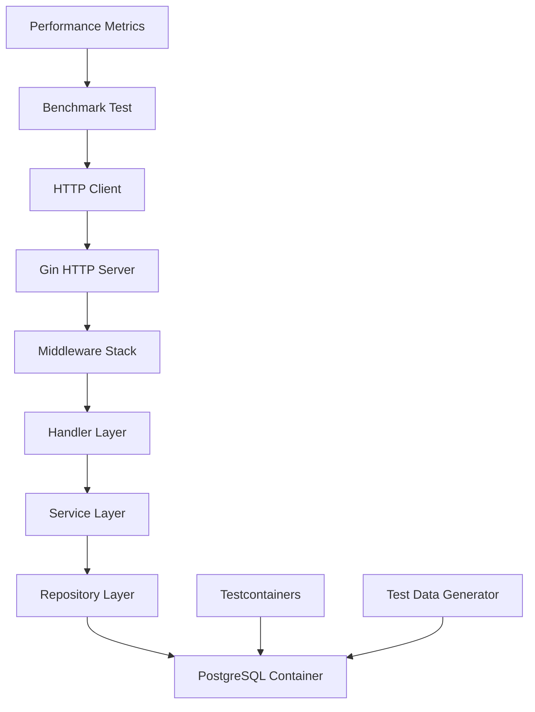

# Design Document

## Overview

This design outlines the implementation of comprehensive benchmark tests for the product requirements management system. The benchmarks will test API endpoint performance using PostgreSQL databases via testcontainers, providing realistic performance measurements that reflect production conditions.

The benchmark implementation follows the ADR-1 requirement to test actual service API endpoints rather than isolated database operations, ensuring measurements capture the full request/response cycle including middleware overhead, JSON serialization, and authentication.

## Architecture

### Benchmark Test Structure

```
internal/benchmarks/
├── setup/
│   ├── server.go          # HTTP server setup for benchmarks
│   ├── database.go        # PostgreSQL testcontainer setup
│   └── data.go           # Test data generation utilities
├── api/
│   ├── epic_bench_test.go        # Epic API endpoint benchmarks
│   ├── user_story_bench_test.go  # User Story API endpoint benchmarks
│   ├── requirement_bench_test.go # Requirement API endpoint benchmarks
│   ├── search_bench_test.go      # Search API endpoint benchmarks
│   └── comment_bench_test.go     # Comment API endpoint benchmarks
└── helpers/
    ├── client.go         # HTTP client utilities
    ├── auth.go          # Authentication helpers
    └── metrics.go       # Performance metrics collection
```

### Test Environment Architecture



## Components and Interfaces

### 1. Benchmark Server Setup

**Purpose**: Create isolated HTTP server instances for each benchmark test suite.

**Key Components**:
- `BenchmarkServer` struct managing server lifecycle
- PostgreSQL testcontainer initialization
- Database migration and seeding
- HTTP server configuration with production-like middleware

**Interface**:
```go
type BenchmarkServer struct {
    Server     *http.Server
    DB         *gorm.DB
    Container  testcontainers.Container
    BaseURL    string
}

func NewBenchmarkServer(b *testing.B) *BenchmarkServer
func (bs *BenchmarkServer) Cleanup()
func (bs *BenchmarkServer) SeedData(entityCounts map[string]int) error
```

### 2. HTTP Client Utilities

**Purpose**: Provide standardized HTTP client functionality for API endpoint testing with parallel request execution capabilities.

**Key Components**:
- Authenticated HTTP client setup
- Request/response helpers
- Error handling utilities
- Performance measurement wrappers
- Parallel HTTP request runners for concurrent testing

**Interface**:
```go
type BenchmarkClient struct {
    Client  *http.Client
    BaseURL string
    Token   string
}

func NewBenchmarkClient(baseURL string) *BenchmarkClient
func (bc *BenchmarkClient) AuthenticateUser(username, password string) error
func (bc *BenchmarkClient) GET(path string) (*http.Response, error)
func (bc *BenchmarkClient) POST(path string, body interface{}) (*http.Response, error)
func (bc *BenchmarkClient) PUT(path string, body interface{}) (*http.Response, error)
func (bc *BenchmarkClient) DELETE(path string) (*http.Response, error)
func (bc *BenchmarkClient) RunParallelRequests(requests []Request, concurrency int) ([]Response, error)
```

### 3. Test Data Generation

**Purpose**: Generate realistic test datasets for performance testing.

**Key Components**:
- Configurable entity generation (Epics, User Stories, Requirements, etc.)
- Relationship creation between entities
- Bulk data insertion utilities
- Data cleanup functions

**Interface**:
```go
type DataGenerator struct {
    DB *gorm.DB
}

func NewDataGenerator(db *gorm.DB) *DataGenerator
func (dg *DataGenerator) CreateUsers(count int) ([]*models.User, error)
func (dg *DataGenerator) CreateEpics(count int, users []*models.User) ([]*models.Epic, error)
func (dg *DataGenerator) CreateUserStories(count int, epics []*models.Epic) ([]*models.UserStory, error)
func (dg *DataGenerator) CreateRequirements(count int, userStories []*models.UserStory) ([]*models.Requirement, error)
func (dg *DataGenerator) CreateSearchableContent(count int) error
```

### 4. Performance Metrics Collection

**Purpose**: Collect and report detailed performance metrics beyond basic Go benchmark stats.

**Key Components**:
- Memory allocation tracking
- Database connection pool metrics
- Response time percentiles
- Concurrent operation measurements

**Interface**:
```go
type MetricsCollector struct {
    StartTime    time.Time
    MemStats     runtime.MemStats
    DBStats      sql.DBStats
}

func NewMetricsCollector() *MetricsCollector
func (mc *MetricsCollector) StartMeasurement()
func (mc *MetricsCollector) EndMeasurement() BenchmarkMetrics
func (mc *MetricsCollector) ReportMetrics(b *testing.B, metrics BenchmarkMetrics)
```

## Data Models

### Benchmark Configuration

```go
type BenchmarkConfig struct {
    DatabaseConfig struct {
        Image    string
        Port     string
        Database string
        Username string
        Password string
    }
    ServerConfig struct {
        Host string
        Port string
    }
    DataSets map[string]DataSetConfig
}

type DataSetConfig struct {
    Users              int
    Epics              int
    UserStoriesPerEpic int
    RequirementsPerUS  int
    Comments           int
}
```

### Performance Metrics

```go
type BenchmarkMetrics struct {
    Duration          time.Duration
    MemoryAllocated   uint64
    MemoryAllocations int64
    GCPauses          []time.Duration
    DBConnections     int
    DBQueries         int64
    ResponseSizes     []int64
}
```

## Error Handling

### Database Connection Errors
- Implement retry logic for container startup
- Graceful degradation when containers fail to start
- Clear error messages for debugging

### HTTP Client Errors
- Timeout handling for slow responses
- Authentication failure recovery
- Network error retry mechanisms

### Test Data Generation Errors
- Validation of generated data integrity
- Cleanup on partial generation failures
- Memory management for large datasets

## Testing Strategy

### Benchmark Test Categories

#### 1. CRUD Operation Benchmarks
**Scope**: Test individual Create, Read, Update, Delete operations via API endpoints

**Test Cases**:
- Epic CRUD operations
- User Story CRUD operations  
- Requirement CRUD operations
- Acceptance Criteria CRUD operations
- Comment CRUD operations

**Metrics**: Operations per second, memory allocation per operation, response time distribution

#### 2. Search Performance Benchmarks
**Scope**: Test full-text search API endpoints with varying dataset sizes

**Test Cases**:
- Simple keyword search
- Complex filtered search
- Paginated search results
- Concurrent search operations
- Large result set handling

**Metrics**: Search latency, index utilization, memory usage, concurrent throughput

#### 3. Bulk Operation Benchmarks
**Scope**: Test API endpoints handling multiple entities

**Test Cases**:
- Batch entity creation
- Bulk updates
- Mass deletion operations
- Large list retrievals

**Metrics**: Throughput for bulk operations, memory scaling, database connection usage

#### 4. Concurrent Access Benchmarks
**Scope**: Test API endpoint performance under concurrent load using multiple parallel HTTP request runners

**Test Cases**:
- Multiple simultaneous CRUD operations with parallel HTTP clients
- Concurrent search requests from multiple goroutines
- Mixed read/write workloads with parallel request runners
- Database connection pool stress testing under concurrent load
- Parallel HTTP request execution to simulate real-world concurrent usage

**Metrics**: Concurrent request handling, resource contention, response time under load, parallel throughput

### Dataset Configurations

#### Small Dataset (Development)
- 10 Users, 25 Epics, 100 User Stories, 300 Requirements
- Used for: Quick benchmark validation, development testing

#### Medium Dataset (CI/CD)
- 50 Users, 100 Epics, 500 User Stories, 1500 Requirements  
- Used for: Continuous integration performance monitoring

#### Large Dataset (Performance Analysis)
- 200 Users, 500 Epics, 2000 User Stories, 6000 Requirements
- Used for: Scalability testing, performance optimization

### Benchmark Execution Strategy

#### Sequential Execution
- Run benchmarks in order: CRUD → Search → Bulk → Concurrent
- Isolate each test with fresh database state
- Measure baseline performance for each operation type

#### Parallel Execution (CI Mode)
- Run independent benchmark suites in parallel
- Reduce total execution time for CI/CD pipelines
- Aggregate results for performance trend analysis

## Integration Points

### Makefile Integration
- Extend existing `test-bench` target to include new API benchmarks
- Add `test-bench-api` target for API-specific benchmarks
- Include benchmark result file generation

### GitHub Actions Integration
- Upload benchmark results as artifacts
- Generate performance comparison reports
- Set performance regression thresholds

### Existing Test Infrastructure
- Leverage existing testcontainers setup patterns
- Reuse authentication and middleware configurations
- Integrate with existing test data models and factories

## Performance Targets

### Response Time Targets
- CRUD operations: < 100ms (95th percentile)
- Simple search: < 200ms (95th percentile)
- Complex search: < 500ms (95th percentile)
- Bulk operations: < 1000ms for 100 entities (95th percentile)

### Throughput Targets
- CRUD operations: > 100 ops/second
- Search operations: > 50 ops/second
- Concurrent requests: > 200 requests/second

### Resource Usage Targets
- Memory allocation: < 10MB per 1000 operations
- Database connections: < 20 concurrent connections
- CPU usage: < 80% during benchmark execution

## Implementation Phases

### Phase 1: Infrastructure Setup
1. Create benchmark package structure
2. Implement BenchmarkServer with testcontainers
3. Create HTTP client utilities
4. Set up basic data generation

### Phase 2: CRUD Benchmarks
1. Implement Epic API benchmarks
2. Implement User Story API benchmarks
3. Implement Requirement API benchmarks
4. Implement Acceptance Criteria API benchmarks

### Phase 3: Search Benchmarks
1. Implement search API benchmarks
2. Add dataset size variations
3. Implement concurrent search testing
4. Add search performance metrics

### Phase 4: Advanced Benchmarks
1. Implement bulk operation benchmarks
2. Add concurrent access testing
3. Implement comment system benchmarks
4. Add relationship management benchmarks

### Phase 5: CI/CD Integration
1. Update Makefile targets
2. Configure GitHub Actions workflow
3. Implement result artifact generation
4. Set up performance regression detection