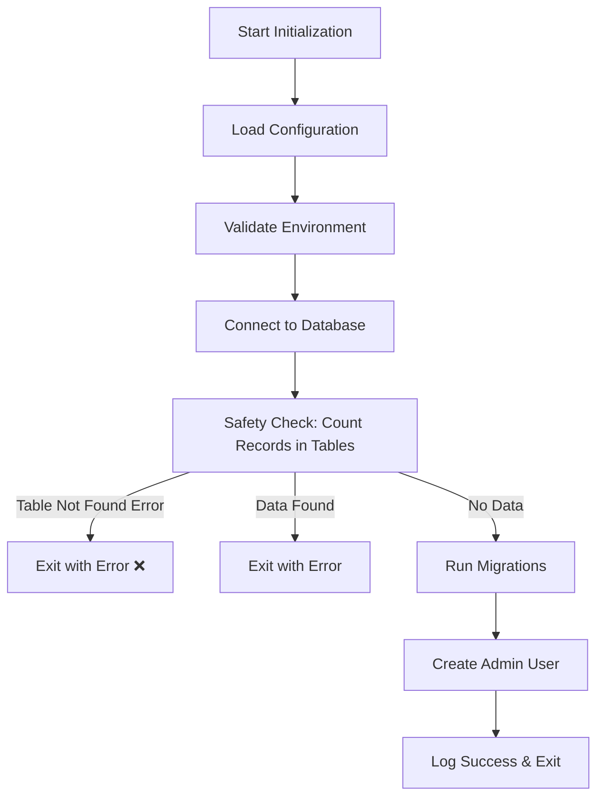
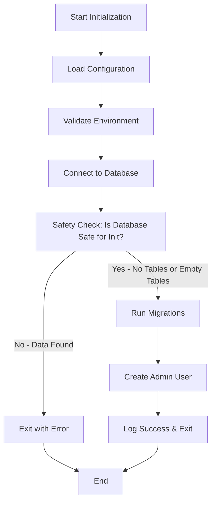
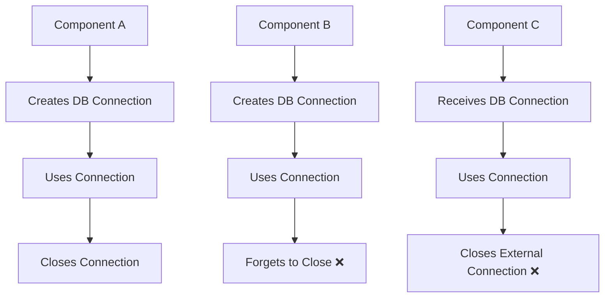
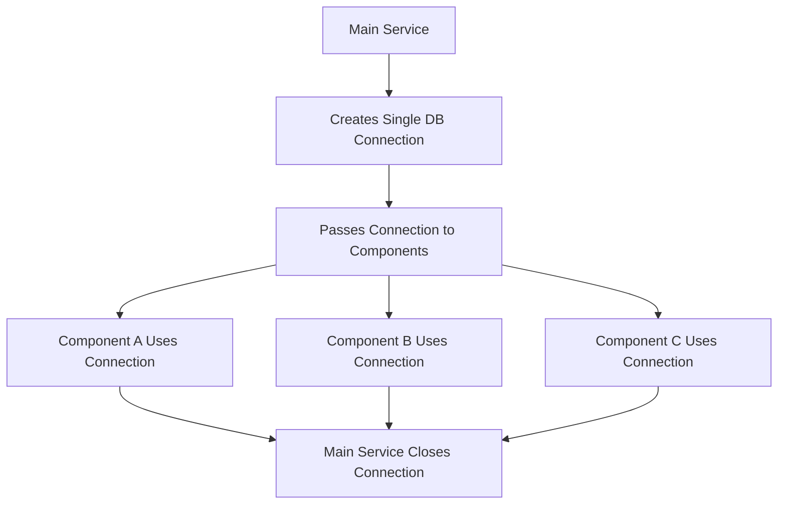

# Design Document

## Overview

This document describes the design for fixing critical database-related issues in the initialization service and establishing proper database connection lifecycle management throughout the project. The design addresses two main problems:

1. **Safety Check Failure**: The initialization service fails when running on an empty database because the safety check logic attempts to count records in tables that don't exist yet.

2. **Database Connection Anti-patterns**: Various components independently manage database connection lifecycles, leading to premature closures, resource leaks, and "database already closed" errors.

The solution involves modifying the `SafetyChecker` component to gracefully handle missing tables and refactoring database connection management to follow centralized lifecycle patterns.

## Architecture

### Current Issues and Solutions

#### Issue 1: Safety Check Failure on Empty Database

**Current Flow (Problematic):**


**Updated Flow (Fixed):**


#### Issue 2: Database Connection Lifecycle Anti-patterns

**Current Anti-pattern:**


**Centralized Pattern (Fixed):**


### Key Design Changes

#### 1. Safety Check Enhancement
The primary modification is in the `GetDataSummary()` method of the `SafetyChecker` struct, which needs to:

1. **Gracefully handle missing tables** - Treat "table not found" errors as zero record count
2. **Preserve existing error handling** - Continue to fail on genuine database errors
3. **Maintain backward compatibility** - Existing behavior for populated databases remains unchanged

#### 2. Database Connection Lifecycle Centralization
- **Single Responsibility**: Each component either creates and manages a connection OR uses a provided connection, never both
- **Clear Ownership**: Connection creator is responsible for cleanup
- **Resource Safety**: Guaranteed connection cleanup through defer patterns

## Components and Interfaces

### Part 1: Safety Check Enhancement

#### 1. SafetyChecker (internal/init/safety.go)

**Current Interface (Unchanged):**
```go
type SafetyChecker struct {
    db *gorm.DB
}

func NewSafetyChecker(db *gorm.DB) *SafetyChecker
func (sc *SafetyChecker) IsDatabaseEmpty() (bool, error)
func (sc *SafetyChecker) GetDataSummary() (*DataSummary, error)
func (sc *SafetyChecker) GetNonEmptyTablesReport() (string, error)
func (sc *SafetyChecker) ValidateEmptyDatabase() error
```

**Key Method Updates:**

#### GetDataSummary() - Enhanced Error Handling
The core logic change involves wrapping each table count operation with error detection:

```go
func (sc *SafetyChecker) GetDataSummary() (*DataSummary, error) {
    summary := &DataSummary{
        NonEmptyTables: make([]string, 0),
    }

    // Define tables to check with their corresponding count fields
    tablesToCheck := []struct {
        name     string
        countPtr *int64
        label    string
    }{
        {"users", &summary.UserCount, "users"},
        {"epics", &summary.EpicCount, "epics"},
        {"user_stories", &summary.UserStoryCount, "user_stories"},
        {"requirements", &summary.RequirementCount, "requirements"},
        {"acceptance_criteria", &summary.AcceptanceCriteriaCount, "acceptance_criteria"},
        {"comments", &summary.CommentCount, "comments"},
    }

    // Check each table with enhanced error handling
    for _, table := range tablesToCheck {
        count, err := sc.countTableRecords(table.name)
        if err != nil {
            return nil, fmt.Errorf("failed to check table %s: %w", table.name, err)
        }
        
        *table.countPtr = count
        if count > 0 {
            summary.NonEmptyTables = append(summary.NonEmptyTables, table.label)
        }
    }

    summary.IsEmpty = len(summary.NonEmptyTables) == 0
    return summary, nil
}
```

#### New Helper Method: countTableRecords()
```go
func (sc *SafetyChecker) countTableRecords(tableName string) (int64, error) {
    var count int64
    err := sc.db.Table(tableName).Count(&count).Error
    
    if err != nil {
        if isTableNotFoundError(err) {
            // Table doesn't exist - treat as empty (0 records)
            return 0, nil
        }
        // Other database errors should be propagated
        return 0, err
    }
    
    return count, nil
}
```

#### New Helper Method: isTableNotFoundError()
```go
func isTableNotFoundError(err error) bool {
    if err == nil {
        return false
    }
    
    // Check for PostgreSQL "undefined_table" error (SQLSTATE 42P01)
    var pgErr *pgconn.PgError
    if errors.As(err, &pgErr) {
        return pgErr.Code == "42P01"
    }
    
    // Fallback: check error message for common patterns
    errMsg := strings.ToLower(err.Error())
    return strings.Contains(errMsg, "does not exist") || 
           strings.Contains(errMsg, "no such table") ||
           strings.Contains(errMsg, "undefined_table")
}
```

#### Required Imports for Safety Check

The updated implementation requires additional imports:
```go
import (
    "errors"
    "strings"
    "github.com/jackc/pgx/v5/pgconn"
)
```

### Part 2: Database Connection Lifecycle Management

#### 2. Migration Module (internal/database/migrate.go)

**Current Interface (Problematic):**
```go
// Current - creates its own connection
func RunMigrations(cfg *config.Config) error
```

**Updated Interface (Fixed):**
```go
// Updated - accepts existing connection
func RunMigrations(db *gorm.DB, cfg *config.Config) error
func RunMigrationsWithConnection(db *gorm.DB, migrationsPath string) error
```

**Key Changes:**
- Remove internal database connection creation
- Accept `*gorm.DB` parameter instead of creating new connection
- Remove connection cleanup logic (caller's responsibility)
- Maintain existing migration logic and error handling

#### 3. Initialization Service (internal/init/service.go)

**Enhanced Interface:**
```go
type Service struct {
    db           *gorm.DB
    safetyChecker *SafetyChecker
    cfg          *config.Config
}

func NewService(cfg *config.Config) (*Service, error)
func (s *Service) Initialize() error
func (s *Service) Close() error  // Existing - handles DB cleanup
```

**Key Changes:**
- Create single database connection in `NewService()`
- Pass connection to all internal components
- Maintain existing `Close()` method for cleanup
- Update migration calls to use existing connection

#### 4. Model Verification Script (scripts/verify_models.go)

**Current Pattern (Problematic):**
```go
func main() {
    db, err := database.NewPostgresDB(cfg)
    if err != nil {
        log.Fatal(err)
    }
    // Missing: defer db.Close()
    
    // Use db...
}
```

**Updated Pattern (Fixed):**
```go
func main() {
    db, err := database.NewPostgresDB(cfg)
    if err != nil {
        log.Fatal(err)
    }
    defer func() {
        if sqlDB, err := db.DB(); err == nil {
            sqlDB.Close()
        }
    }()
    
    // Use db...
}
```

#### 5. Repository Usage Example (internal/repository/example_usage.go)

**Current Pattern (Problematic):**
```go
func ExampleUsage() {
    db, err := database.NewPostgresDB(cfg)
    if err != nil {
        log.Fatal(err)
    }
    // Missing: defer db.Close()
    
    // Use repositories...
}
```

**Updated Pattern (Fixed):**
```go
func ExampleUsage() {
    db, err := database.NewPostgresDB(cfg)
    if err != nil {
        log.Fatal(err)
    }
    defer func() {
        if sqlDB, err := db.DB(); err == nil {
            sqlDB.Close()
        }
    }()
    
    // Use repositories...
}
```

## Data Models

### DataSummary (Unchanged)
The existing `DataSummary` struct remains unchanged:
```go
type DataSummary struct {
    UserCount               int64    `json:"user_count"`
    EpicCount               int64    `json:"epic_count"`
    UserStoryCount          int64    `json:"user_story_count"`
    RequirementCount        int64    `json:"requirement_count"`
    AcceptanceCriteriaCount int64    `json:"acceptance_criteria_count"`
    CommentCount            int64    `json:"comment_count"`
    IsEmpty                 bool     `json:"is_empty"`
    NonEmptyTables          []string `json:"non_empty_tables"`
}
```

## Error Handling

### Error Classification

1. **Expected Errors (Handled Gracefully):**
   - PostgreSQL SQLSTATE 42P01 ("undefined_table")
   - Generic "table does not exist" messages
   - "no such table" messages (SQLite compatibility)

2. **Unexpected Errors (Propagated):**
   - Database connection failures
   - Permission errors
   - Syntax errors
   - Any other database-related errors

### Error Handling Strategy

```go
// Graceful handling for missing tables
if isTableNotFoundError(err) {
    log.Debugf("Table %s does not exist, treating as empty", tableName)
    return 0, nil
}

// Propagate all other errors
return 0, fmt.Errorf("database error while checking table %s: %w", tableName, err)
```

### Logging Strategy

- **Debug Level:** Log when tables are missing (expected in empty database)
- **Error Level:** Log genuine database errors
- **Info Level:** Log safety check results (empty/non-empty)

## Testing Strategy

### Part 1: Safety Check Tests

#### Unit Tests
- Test `isTableNotFoundError()` with various PostgreSQL error types
- Test `countTableRecords()` with missing tables
- Test `GetDataSummary()` with mixed scenarios (some tables exist, some don't)
- Mock GORM database responses for different error conditions

#### Integration Tests
- Test against truly empty PostgreSQL database (no schema)
- Test against database with schema but no data
- Test against database with partial data
- Test against database with full data
- Verify migration process works after safety check passes

#### Test Cases

1. **Empty Database (No Schema):**
   - All tables missing → Should return `IsEmpty: true`
   - Should proceed to migrations

2. **Empty Database (With Schema):**
   - All tables exist but empty → Should return `IsEmpty: true`
   - Should proceed to migrations

3. **Partially Populated Database:**
   - Some tables have data → Should return `IsEmpty: false`
   - Should exit with error and detailed report

4. **Database Connection Issues:**
   - Connection failures → Should propagate error
   - Permission issues → Should propagate error

### Part 2: Database Connection Lifecycle Tests

#### Unit Tests
- Test migration module with provided connection (no internal connection creation)
- Test initialization service connection management
- Mock database connections to verify proper lifecycle handling

#### Integration Tests
- Test complete initialization flow with centralized connection management
- Verify no connection leaks during normal operation
- Test error scenarios with proper connection cleanup

#### Resource Management Tests
- Verify scripts properly close database connections
- Test example code follows correct patterns
- Audit existing code for connection lifecycle anti-patterns

### Backward Compatibility Tests
- Verify existing behavior unchanged for populated databases
- Verify error messages remain informative
- Verify migration process unchanged after safety check passes
- Ensure API compatibility for all modified components

## Performance Considerations

### Optimizations
- **Single Query Per Table:** Each table checked with one COUNT query
- **Early Exit:** Stop checking once any table has data (optional enhancement)
- **Connection Reuse:** Use existing database connection

### Scalability
- Current approach scales linearly with number of tables
- COUNT queries are efficient even on large tables
- No impact on migration performance

## Security Considerations

### Safety Mechanisms Preserved
- **Data Protection:** Still prevents initialization on populated databases
- **Explicit Validation:** Requires explicit confirmation that database is empty
- **Detailed Reporting:** Provides clear information about existing data

### Enhanced Safety
- **Graceful Degradation:** Handles missing tables without crashing
- **Error Transparency:** Clear distinction between expected and unexpected errors
- **Audit Trail:** Comprehensive logging of safety check process

## Migration Path

### Implementation Steps

#### Phase 1: Safety Check Enhancement
1. Add new helper methods (`countTableRecords`, `isTableNotFoundError`)
2. Refactor `GetDataSummary()` to use new error handling
3. Add required imports for PostgreSQL error handling
4. Update tests to cover new scenarios
5. Verify backward compatibility

#### Phase 2: Database Connection Lifecycle Refactoring
1. Modify migration module to accept existing database connection
2. Update initialization service to use centralized connection management
3. Fix model verification script with proper connection cleanup
4. Fix repository usage example with proper connection cleanup
5. Audit and fix any other connection lifecycle issues

#### Phase 3: Testing and Validation
1. Run comprehensive test suite for both changes
2. Verify no resource leaks in integration tests
3. Test complete initialization flow end-to-end
4. Validate backward compatibility

### Deployment Considerations
- **Zero Downtime:** Changes are backward compatible
- **Rollback Safe:** Can revert to previous version if needed
- **Database Agnostic:** Works with both PostgreSQL and SQLite (for tests)
- **Resource Safety:** Improved connection management reduces resource leaks
- **Error Resilience:** Better error handling for edge cases