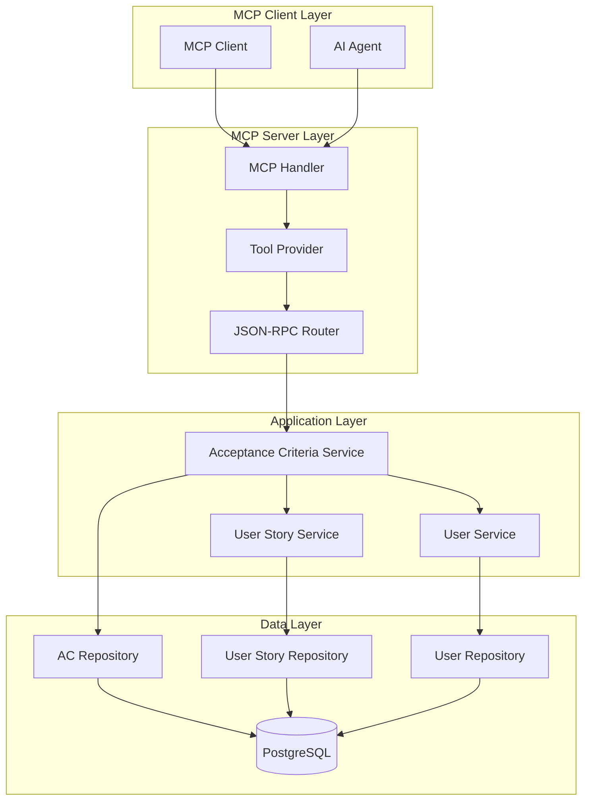

# Design Document

## Overview

This design document outlines the technical implementation for MCP (Model Context Protocol) client functionality to create acceptance criteria for user stories. The system will provide MCP tools that allow AI agents and other MCP clients to programmatically create acceptance criteria with proper validation, linking to user stories, and comprehensive field management.

The implementation follows the existing system architecture patterns and integrates seamlessly with the current MCP infrastructure, providing JSON-RPC 2.0 compliant tools for acceptance criteria management.

## Architecture

### High-Level Architecture



### Component Integration

The MCP acceptance criteria management integrates with existing system components:

1. **MCP Infrastructure**: Leverages existing JSON-RPC 2.0 framework and tool provider patterns
2. **Service Layer**: Extends current acceptance criteria service with MCP-specific methods
3. **Repository Layer**: Uses existing repository patterns for data access
4. **Validation Layer**: Implements comprehensive validation following EARS requirements
5. **Authentication**: Integrates with existing JWT-based authentication system

## Components and Interfaces

### MCP Tool Interface

```go
// AcceptanceCriteriaTool implements MCP tool interface for acceptance criteria creation
type AcceptanceCriteriaTool struct {
    service service.AcceptanceCriteriaService
    userStoryService service.UserStoryService
    logger *logrus.Logger
}

// Tool definition following MCP specification
type AcceptanceCriteriaToolDefinition struct {
    Name        string                 `json:"name"`
    Description string                 `json:"description"`
    InputSchema AcceptanceCriteriaSchema `json:"inputSchema"`
}

// MCP Tool JSON Schema for acceptance criteria creation
var AcceptanceCriteriaToolSchema = map[string]interface{}{
    "type": "object",
    "properties": map[string]interface{}{
        "user_story_id": map[string]interface{}{
            "type":        "string",
            "description": "User story UUID or reference ID (e.g., US-001)",
            "pattern":     "^(US-\\d+|[0-9a-f]{8}-[0-9a-f]{4}-[0-9a-f]{4}-[0-9a-f]{4}-[0-9a-f]{12})$",
        },
        "description": map[string]interface{}{
            "type":        "string",
            "description": "Detailed description of the acceptance criteria in EARS format",
            "maxLength":   50000,
        },
    },
    "required": []string{"user_story_id", "description"},
    "additionalProperties": false,
}
```

### JSON-RPC Request/Response Structures

```go
// MCP tool call request structure
type CreateAcceptanceCriteriaRequest struct {
    UserStoryID string `json:"user_story_id" validate:"required"`
    Description string `json:"description" validate:"required,max=50000"`
}

// MCP tool call response structure
type CreateAcceptanceCriteriaResponse struct {
    ID          string    `json:"id"`
    ReferenceID string    `json:"reference_id"`
    UserStoryID string    `json:"user_story_id"`
    Description string    `json:"description"`
    AuthorID    string    `json:"author_id"`
    CreatedAt   time.Time `json:"created_at"`
    UpdatedAt   time.Time `json:"updated_at"`
}

// JSON-RPC error response structure
type MCPErrorResponse struct {
    Code    int         `json:"code"`
    Message string      `json:"message"`
    Data    interface{} `json:"data,omitempty"`
}
```

### Service Layer Extensions

```go
// Extended service interface for MCP operations
type MCPAcceptanceCriteriaService interface {
    // Existing service methods
    service.AcceptanceCriteriaService
    
    // MCP-specific methods
    CreateAcceptanceCriteriaViaMCP(req MCPCreateAcceptanceCriteriaRequest) (*models.AcceptanceCriteria, error)
    ValidateUserStoryReference(reference string) (*models.UserStory, error)
    ResolveUserStoryIdentifier(identifier string) (uuid.UUID, error)
}

// MCP-specific request structure
type MCPCreateAcceptanceCriteriaRequest struct {
    UserStoryIdentifier string `json:"user_story_id"` // UUID or reference ID
    Description        string `json:"description"`
    AuthorID           uuid.UUID `json:"-"` // Set from authentication context
}
```

## Data Models

### Acceptance Criteria Model 

The existing `AcceptanceCriteria` model will be used:

```go
// AcceptanceCriteria model (uses existing structure)
type AcceptanceCriteria struct {
	ID          uuid.UUID `gorm:"type:uuid;primary_key" json:"id" example:"123e4567-e89b-12d3-a456-426614174000"`                                                                                           // Unique identifier for the acceptance criteria
	ReferenceID string    `gorm:"uniqueIndex;not null" json:"reference_id" example:"AC-001"`                                                                                                                // Human-readable reference identifier
	UserStoryID uuid.UUID `gorm:"not null" json:"user_story_id" example:"123e4567-e89b-12d3-a456-426614174001"`                                                                                             // ID of the parent user story
	AuthorID    uuid.UUID `gorm:"not null" json:"author_id" example:"123e4567-e89b-12d3-a456-426614174002"`                                                                                                 // ID of the user who authored this acceptance criteria
	CreatedAt   time.Time `json:"created_at" example:"2023-01-01T00:00:00Z"`                                                                                                                                // Timestamp when the acceptance criteria was created
	UpdatedAt   time.Time `json:"updated_at" db:"updated_at" example:"2023-01-02T12:30:00Z"`                                                                                                                // Timestamp when the acceptance criteria was last modified
	Description string    `gorm:"not null" json:"description" validate:"required" example:"WHEN a user enters valid credentials THEN the system SHALL authenticate the user and redirect to the dashboard"` // EARS format description of the acceptance criteria

	// Relationships
	UserStory    UserStory     `gorm:"foreignKey:UserStoryID;constraint:OnDelete:CASCADE" json:"user_story,omitempty"`             // Parent user story that this acceptance criteria belongs to
	Author       User          `gorm:"foreignKey:AuthorID;constraint:OnDelete:RESTRICT" json:"author,omitempty"`                   // User who authored this acceptance criteria
	Requirements []Requirement `gorm:"foreignKey:AcceptanceCriteriaID;constraint:OnDelete:SET NULL" json:"requirements,omitempty"` // Requirements linked to this acceptance criteria
	Comments     []Comment     `gorm:"polymorphic:Entity;polymorphicValue:acceptance_criteria" json:"comments,omitempty"`          // Comments associated with this acceptance criteria
}
```

### Database Migration

No database schema changes are required as the existing `AcceptanceCriteria` model already supports all necessary fields for the MCP implementation

## Error Handling

### JSON-RPC Error Codes

Following JSON-RPC 2.0 specification and MCP conventions:

```go
const (
    // Standard JSON-RPC errors
    ParseError     = -32700 // Invalid JSON
    InvalidRequest = -32600 // Invalid Request
    MethodNotFound = -32601 // Method not found
    InvalidParams  = -32602 // Invalid params
    InternalError  = -32603 // Internal error
    
    // Server error range (-32099 to -32000)
    ServerErrorUnauthorized = -32001 // Authentication required
    ServerErrorForbidden    = -32002 // Insufficient permissions
)

// Error mapping for acceptance criteria operations
var ErrorCodeMap = map[error]int{
    service.ErrUserStoryNotFound:           InvalidParams,
    service.ErrUserNotFound:               InvalidParams,
    service.ErrAcceptanceCriteriaNotFound: InvalidParams,
    // Authentication errors
    auth.ErrUnauthorized:                  ServerErrorUnauthorized,
    auth.ErrInsufficientPermissions:       ServerErrorForbidden,
}
```

### Validation Error Handling

```go
// Comprehensive validation error structure
type ValidationError struct {
    Field   string `json:"field"`
    Message string `json:"message"`
    Code    string `json:"code"`
}

// Validation error response
type ValidationErrorResponse struct {
    Code             int                `json:"code"`
    Message          string             `json:"message"`
    ValidationErrors []ValidationError  `json:"validation_errors"`
}

// Field-specific validation rules
var ValidationRules = map[string][]ValidationRule{
    "user_story_id": {
        {Type: "required", Message: "User story identifier is required"},
        {Type: "format", Message: "Must be UUID or reference ID format (US-XXX)"},
    },
    "description": {
        {Type: "required", Message: "Description is required"},
        {Type: "max_length", Value: 50000, Message: "Description must not exceed 50000 characters"},
    },
}
```

## Testing Strategy

### Unit Testing

```go
// Test structure for MCP acceptance criteria tool
type AcceptanceCriteriaToolTestSuite struct {
    suite.Suite
    tool    *AcceptanceCriteriaTool
    service *mocks.MockAcceptanceCriteriaService
    userStoryService *mocks.MockUserStoryService
    logger  *logrus.Logger
}

// Test cases covering all requirements
func (suite *AcceptanceCriteriaToolTestSuite) TestCreateAcceptanceCriteria_Success() {
    // Test successful creation with UUID
    // Test successful creation with reference ID
    // Test all required fields validation
    // Test character limits for description
}

func (suite *AcceptanceCriteriaToolTestSuite) TestCreateAcceptanceCriteria_ValidationErrors() {
    // Test missing required fields
    // Test invalid user story identifier
    // Test description field length limits
}

func (suite *AcceptanceCriteriaToolTestSuite) TestCreateAcceptanceCriteria_AuthenticationErrors() {
    // Test missing authentication
    // Test insufficient permissions
}
```

### Integration Testing

No new integration tests needed

### MCP Protocol Testing

```go
// Test MCP protocol compliance
func TestMCPProtocolCompliance(t *testing.T) {
    // Test JSON-RPC 2.0 format compliance
    // Test tool discovery via tools/list
    // Test tool execution via tools/call
    // Test error response format
    // Test authentication integration
}
```

## Security Considerations

### Authentication and Authorization

The MCP acceptance criteria tool will use the existing authentication infrastructure without requiring additional middleware or authentication code:

**Existing Authentication Pattern:**
- MCP routes use `auth.PATMiddleware(authService, patService)` which supports  Personal Access Token (PAT) 
- The middleware automatically validates tokens and sets user context in Gin context
- User information is accessible via `auth.GetCurrentUserID(c)` and `auth.GetUserFromContext(c)`

**Integration with Existing System:**
```go
// The MCP tool will extract user context using existing patterns
func (t *AcceptanceCriteriaTool) CreateAcceptanceCriteria(ctx context.Context, params map[string]interface{}) (interface{}, error) {
    // Extract user ID from Gin context (set by existing PATMiddleware)
    userID, ok := auth.GetCurrentUserID(ginContext)
    if !ok {
        return nil, jsonrpc.NewError(jsonrpc.ServerErrorUnauthorized, "Authentication required", nil)
    }
    
    // Use existing service layer with authenticated user ID
    req := service.CreateAcceptanceCriteriaRequest{
        UserStoryID: userStoryID,
        AuthorID:    uuid.MustParse(userID),
        Description: description,
    }
    
    return t.service.CreateAcceptanceCriteria(req)
}
```

**No Additional Authentication Code Required:**
- Leverages existing `auth.PATMiddleware` from routes.go
- Uses existing `auth.GetCurrentUserID()` helper function
- Integrates with existing JWT and PAT token validation
- Follows established authentication patterns used by other MCP tools

### Input Validation and Sanitization

```go
// Comprehensive input validation
type InputValidator struct {
    validator *validator.Validate
}

// Validate and sanitize MCP request
func (v *InputValidator) ValidateCreateRequest(req *CreateAcceptanceCriteriaRequest) error {
    // Validate required fields
    // Check field lengths and formats
    // Sanitize input to prevent injection attacks
    // Validate user story identifier format
}

// Sanitize text inputs
func (v *InputValidator) SanitizeTextInput(input string) string {
    // Remove potentially harmful characters
    // Normalize whitespace
    // Preserve formatting for description field
}
```


## Implementation Plan

### Phase 1: Core MCP Tool Implementation

1. **MCP Tool Structure**
   - Implement `AcceptanceCriteriaTool` following existing patterns
   - Define JSON schema for tool parameters
   - Implement tool discovery and execution methods

2. **Service Layer Extensions**
   - Extend `AcceptanceCriteriaService` with MCP-specific methods
   - Implement user story identifier resolution (UUID/reference ID)
   - Add comprehensive validation logic

3. **Request/Response Handling**
   - Implement JSON-RPC 2.0 compliant request parsing
   - Create structured response formatting
   - Implement error mapping and response generation

### Phase 2: Validation and Error Handling

1. **Input Validation**
   - Implement field-level validation rules
   - Add format validation for user story identifiers
   - Implement character limit enforcement

2. **Error Response System**
   - Map service errors to JSON-RPC error codes
   - Implement detailed error messages
   - Add validation error aggregation

3. **Authentication Integration**
   - Integrate with existing JWT authentication
   - Implement user context extraction
   - Add authorization checks

### Phase 3: Database and Model Integration

1. **Model Integration**
   - Use existing `AcceptanceCriteria` model without modifications
   - Update validation rules for MCP-specific requirements
   - Ensure compatibility with existing database schema

2. **Repository Updates**
   - Add optimized queries for MCP operations
   - Implement reference ID resolution methods
   - Enhance user story lookup capabilities

3. **Reference ID Generation**
   - Integrate with existing reference ID system
   - Ensure thread-safe generation for acceptance criteria
   - Add proper error handling for ID conflicts

### Phase 4: Testing and Integration

1. **Unit Testing**
   - Comprehensive test coverage for all components
   - Mock-based testing for service layer
   - Validation rule testing

## Deployment Considerations


### Monitoring and Logging

The MCP acceptance criteria tool will integrate with existing monitoring and logging infrastructure:

**Existing Infrastructure Integration:**
- Uses existing `logrus.Logger` instance passed to the tool
- Leverages existing structured logging patterns used by other MCP tools
- Integrates with existing error tracking and monitoring systems
- Follows established logging conventions for MCP operations

**Implementation Approach:**
- Reuse existing logger configuration and formatting
- Follow existing error handling and logging patterns from other MCP tools
- Integrate with existing metrics collection if available
- Use existing correlation ID and request tracking mechanisms

This design provides a comprehensive foundation for implementing MCP acceptance criteria management functionality while maintaining consistency with existing system architecture and ensuring robust error handling, security, and performance.