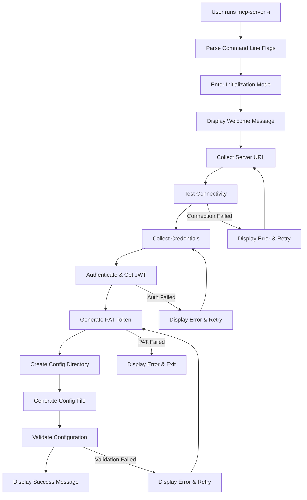
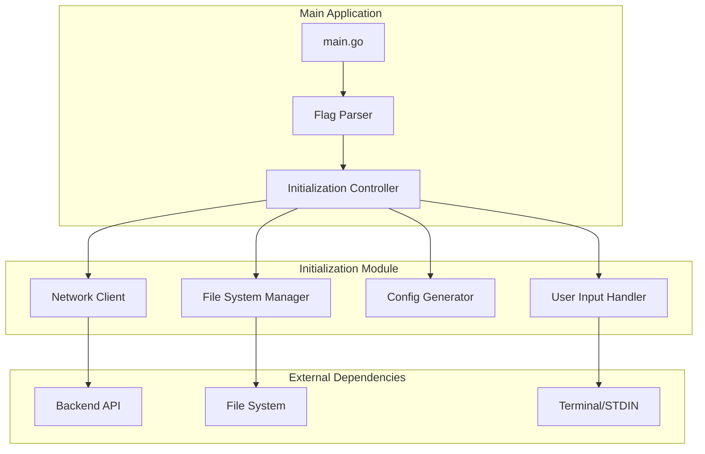

# Design Document

## Overview

The MCP Server Initialization feature provides an interactive command-line setup mode that simplifies the initial configuration process for users. When activated with the `-i` or `--init` flag, the application guides users through server connection setup, credential collection, PAT token generation, and configuration file creation. This eliminates the need for manual PAT generation through the web interface and reduces setup complexity.

## Architecture

### High-Level Flow



### Component Architecture



## Components and Interfaces

### 1. Command Line Interface

**Location**: `cmd/mcp-server/main.go`

```go
type InitFlags struct {
    Init       bool   // -i, --init flag
    ConfigPath string // -config flag (optional)
}

func parseFlags() InitFlags
func runInitialization(configPath string) error
```

**Responsibilities**:
- Parse command-line flags
- Determine if initialization mode should be activated
- Route to appropriate initialization or normal server startup

### 2. Initialization Controller

**Location**: `internal/mcp/client/init/controller.go`

```go
type InitController struct {
    inputHandler  *InputHandler
    networkClient *NetworkClient
    configGen     *ConfigGenerator
    fileManager   *FileManager
}

func NewInitController() *InitController
func (c *InitController) RunInitialization(configPath string) error
```

**Responsibilities**:
- Orchestrate the entire initialization process
- Handle error recovery and retry logic
- Coordinate between different components

### 3. User Input Handler

**Location**: `internal/mcp/client/init/input.go`

```go
type InputHandler struct {
    reader *bufio.Reader
}

type ServerConfig struct {
    URL      string
    Username string
    Password string
}

func NewInputHandler() *InputHandler
func (h *InputHandler) CollectServerURL() (string, error)
func (h *InputHandler) CollectCredentials() (username, password string, err error)
func (h *InputHandler) ConfirmOverwrite(existingPath string) (bool, error)
func (h *InputHandler) DisplayWelcome()
func (h *InputHandler) DisplaySuccess(configPath string)
```

**Responsibilities**:
- Handle all user interactions and input collection
- Provide secure password input (hidden)
- Display progress messages and user guidance
- Handle confirmation prompts

### 4. Network Client

**Location**: `internal/mcp/client/init/client.go`

```go
type NetworkClient struct {
    httpClient *http.Client
    baseURL    string
}

type AuthResponse struct {
    Token     string    `json:"token"`
    ExpiresAt time.Time `json:"expires_at"`
    User      User      `json:"user"`
}

type PATResponse struct {
    Token     string    `json:"token"`
    ExpiresAt time.Time `json:"expires_at"`
    Name      string    `json:"name"`
}

func NewNetworkClient(baseURL string) *NetworkClient
func (c *NetworkClient) TestConnectivity() error
func (c *NetworkClient) Authenticate(username, password string) (*AuthResponse, error)
func (c *NetworkClient) CreatePAT(jwtToken string) (*PATResponse, error)
func (c *NetworkClient) ValidatePAT(patToken string) error
```

**Responsibilities**:
- Handle all HTTP communication with backend API
- Test server connectivity
- Perform authentication and PAT generation
- Validate generated PAT tokens

### 5. Configuration Generator

**Location**: `internal/mcp/client/init/config.go`

```go
type ConfigGenerator struct{}

type GeneratedConfig struct {
    BackendAPIURL  string `json:"backend_api_url"`
    PATToken       string `json:"pat_token"`
    RequestTimeout string `json:"request_timeout"`
    LogLevel       string `json:"log_level"`
}

func NewConfigGenerator() *ConfigGenerator
func (g *ConfigGenerator) GenerateConfig(apiURL, patToken string) *GeneratedConfig
func (g *ConfigGenerator) ValidateConfig(config *GeneratedConfig) error
```

**Responsibilities**:
- Generate configuration structure with appropriate defaults
- Validate configuration completeness and format
- Ensure compatibility with existing Config struct

### 6. File System Manager

**Location**: `internal/mcp/client/init/filesystem.go`

```go
type FileManager struct{}

func NewFileManager() *FileManager
func (f *FileManager) EnsureConfigDirectory(configPath string) error
func (f *FileManager) BackupExistingConfig(configPath string) (string, error)
func (f *FileManager) WriteConfig(configPath string, config *GeneratedConfig) error
func (f *FileManager) SetSecurePermissions(filePath string) error
func (f *FileManager) ConfigExists(configPath string) bool
```

**Responsibilities**:
- Manage configuration directory creation
- Handle file operations with proper permissions
- Create backups of existing configurations
- Ensure secure file storage

## Data Models

### Configuration Structure

```go
// Matches existing internal/mcp/config.go structure
type Config struct {
    BackendAPIURL  string `json:"backend_api_url"`
    PATToken       string `json:"pat_token"`
    RequestTimeout string `json:"request_timeout"`
    LogLevel       string `json:"log_level"`
}
```

### API Request/Response Models

```go
// Authentication
type LoginRequest struct {
    Username string `json:"username"`
    Password string `json:"password"`
}

type LoginResponse struct {
    Token     string    `json:"token"`
    ExpiresAt time.Time `json:"expires_at"`
    User      UserInfo  `json:"user"`
}

// PAT Creation
type CreatePATRequest struct {
    Name        string    `json:"name"`
    Description string    `json:"description"`
    ExpiresAt   time.Time `json:"expires_at"`
}

type CreatePATResponse struct {
    Token     string    `json:"token"`
    ExpiresAt time.Time `json:"expires_at"`
    Name      string    `json:"name"`
}
```

## Error Handling

### Error Types

```go
type InitError struct {
    Type    ErrorType
    Message string
    Cause   error
}

type ErrorType int

const (
    ErrorTypeNetwork ErrorType = iota
    ErrorTypeAuth
    ErrorTypeFileSystem
    ErrorTypeValidation
    ErrorTypeUserInput
)
```

### Error Handling Strategy

1. **Network Errors**: Retry with user confirmation, provide connectivity troubleshooting
2. **Authentication Errors**: Clear error messages, allow credential re-entry
3. **File System Errors**: Check permissions, provide specific path information
4. **Validation Errors**: Display specific validation failures, guide user to fix
5. **User Input Errors**: Re-prompt with guidance, validate input format

### Recovery Mechanisms

- **Connection Failures**: Allow URL re-entry and retry
- **Authentication Failures**: Allow credential re-entry up to 3 attempts
- **PAT Creation Failures**: Display API error and exit gracefully
- **File System Failures**: Suggest permission fixes and alternative paths

## Testing Strategy

### Unit Tests

1. **Input Handler Tests**:
   - Mock user input scenarios
   - Test password masking functionality
   - Validate input parsing and validation

2. **Network Client Tests**:
   - Mock HTTP responses for all API endpoints
   - Test error handling for network failures
   - Validate request formatting and authentication

3. **Config Generator Tests**:
   - Test configuration structure generation
   - Validate default value assignment
   - Test configuration validation logic

4. **File Manager Tests**:
   - Test directory creation and permissions
   - Test backup functionality
   - Test secure file writing

### Integration Tests

1. **End-to-End Flow**:
   - Test complete initialization process with test server
   - Validate generated configuration works with normal server startup
   - Test error recovery scenarios

2. **API Integration**:
   - Test against real backend API endpoints
   - Validate PAT generation and validation flow
   - Test authentication error scenarios

### Test Data

```go
// Test configuration for integration tests
type TestConfig struct {
    TestServerURL string
    TestUsername  string
    TestPassword  string
    TempConfigDir string
}
```

## Security Considerations

### Credential Handling

1. **Password Input**: Use `golang.org/x/term` package for secure password input
2. **Memory Management**: Clear sensitive data from memory after use
3. **Logging**: Never log passwords, tokens, or other sensitive information
4. **Error Messages**: Sanitize error messages to avoid credential leakage

### File Security

1. **Config File Permissions**: Set to 0600 (owner read/write only)
2. **Directory Permissions**: Set to 0755 (owner full, others read/execute)
3. **Backup Files**: Apply same security permissions as original
4. **Temporary Files**: Avoid creating temporary files with sensitive data

### Network Security

1. **HTTPS Only**: Enforce HTTPS for all API communications
2. **Certificate Validation**: Validate SSL certificates
3. **Token Handling**: Use secure HTTP headers for token transmission
4. **Timeout Configuration**: Set reasonable timeouts to prevent hanging

## Implementation Details

### Flag Parsing Enhancement

```go
// In cmd/mcp-server/main.go
func main() {
    var (
        configPath = flag.String("config", "", "Path to configuration file")
        initMode   = flag.Bool("i", false, "Run in initialization mode")
        initLong   = flag.Bool("init", false, "Run in initialization mode")
    )
    flag.Parse()

    if *initMode || *initLong {
        if err := runInitialization(*configPath); err != nil {
            fmt.Fprintf(os.Stderr, "Initialization failed: %v\n", err)
            os.Exit(1)
        }
        return
    }

    // Normal server startup...
}
```

### Configuration Path Resolution

```go
func resolveConfigPath(providedPath string) (string, error) {
    if providedPath != "" {
        return providedPath, nil
    }
    
    homeDir, err := os.UserHomeDir()
    if err != nil {
        return "", fmt.Errorf("failed to get user home directory: %w", err)
    }
    
    return filepath.Join(homeDir, ".requirements-mcp", "config.json"), nil
}
```

### PAT Token Configuration

```go
func generatePATRequest(hostname string) *CreatePATRequest {
    return &CreatePATRequest{
        Name:        fmt.Sprintf("MCP Server - %s - %s", hostname, time.Now().Format("2006-01-02")),
        Description: "Auto-generated PAT for MCP Server initialization",
        ExpiresAt:   time.Now().AddDate(1, 0, 0), // 1 year from now
    }
}
```

### Progress Indicators

```go
type ProgressIndicator struct {
    message string
    done    chan bool
}

func (p *ProgressIndicator) Start(message string) {
    p.message = message
    p.done = make(chan bool)
    go p.animate()
}

func (p *ProgressIndicator) Stop() {
    p.done <- true
}

func (p *ProgressIndicator) animate() {
    chars := []string{"|", "/", "-", "\\"}
    i := 0
    for {
        select {
        case <-p.done:
            fmt.Print("\r" + strings.Repeat(" ", len(p.message)+10) + "\r")
            return
        default:
            fmt.Printf("\r%s %s", p.message, chars[i%len(chars)])
            time.Sleep(100 * time.Millisecond)
            i++
        }
    }
}
```

## Integration with Existing System

### Configuration Compatibility

The generated configuration must be fully compatible with the existing `internal/mcp/config.go` structure:

```go
// Ensure generated config passes existing validation
func validateGeneratedConfig(config *GeneratedConfig) error {
    // Convert to existing Config struct
    existingConfig := &mcp.Config{
        BackendAPIURL:  config.BackendAPIURL,
        PATToken:       config.PATToken,
        RequestTimeout: config.RequestTimeout,
        LogLevel:       config.LogLevel,
    }
    
    // Use existing validation logic
    return existingConfig.Validate()
}
```

### Startup Flow Integration

```go
func main() {
    // Parse flags first
    flags := parseFlags()
    
    if flags.Init {
        // Run initialization mode
        if err := runInitialization(flags.ConfigPath); err != nil {
            handleInitError(err)
            os.Exit(1)
        }
        return
    }
    
    // Continue with normal server startup
    config, err := mcp.LoadConfigFromPath(flags.ConfigPath)
    // ... rest of existing main function
}
```

This design provides a comprehensive, secure, and user-friendly initialization system that integrates seamlessly with the existing MCP server architecture while maintaining security best practices and providing excellent user experience.