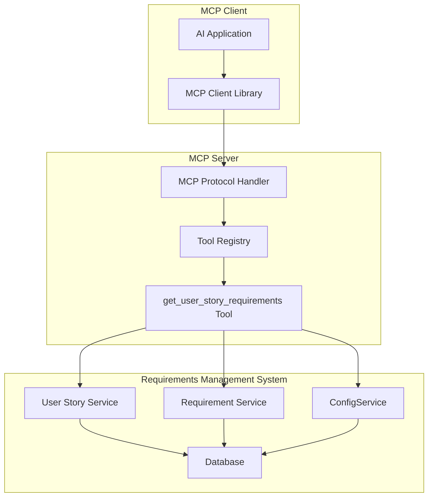

# Design Document

## Overview

This document outlines the design for implementing the `get_user_story_requirements` MCP tool that allows MCP clients to retrieve all requirements linked to a specific user story. The tool will integrate with the existing requirements management system and provide structured, human-readable output through the MCP protocol.

## Architecture

### High-Level Architecture



### Component Integration

The tool integrates with existing system components:
- **MCP Server Framework**: Handles protocol communication and tool registration
- **User Story Service**: Validates user story existence and retrieves metadata
- **Requirement Service**: Fetches requirements linked to user stories
- **ConfigService**: Resolves requirement type names from IDs using existing methods
- **Database Layer**: Provides data persistence and querying capabilities

## Components and Interfaces

### MCP Tool Handler Implementation

Following the existing pattern in `internal/mcp/tools`, we'll extend the UserStoryHandler:

```go
// Extend existing UserStoryHandler in internal/mcp/tools/user_story.go
func (h *UserStoryHandler) GetSupportedTools() []string {
    return []string{
        "create_user_story",
        "update_user_story",
        "get_user_story_requirements", // Add new tool
    }
}

func (h *UserStoryHandler) HandleTool(ctx context.Context, toolName string, args map[string]interface{}) (interface{}, error) {
    switch toolName {
    case "create_user_story":
        return h.Create(ctx, args)
    case "update_user_story":
        return h.Update(ctx, args)
    case "get_user_story_requirements": // Add new handler
        return h.GetRequirements(ctx, args)
    default:
        return nil, jsonrpc.NewMethodNotFoundError(fmt.Sprintf("Unknown tool: %s", toolName))
    }
}
```

### Tool Implementation

```go
// GetRequirements handles the get_user_story_requirements tool
func (h *UserStoryHandler) GetRequirements(ctx context.Context, args map[string]interface{}) (interface{}, error) {
    // Validate required arguments using existing helper
    if err := validateRequiredArgs(args, []string{"user_story"}); err != nil {
        return nil, err
    }

    userStoryIDStr, _ := getStringArg(args, "user_story")
    if userStoryIDStr == "" {
        return nil, jsonrpc.NewInvalidParamsError("Missing or invalid 'user_story' argument")
    }

    // Parse user story ID (UUID or reference ID) using existing helper
    userStoryID, err := parseUUIDOrReferenceID(userStoryIDStr, func(refID string) (interface{}, error) {
        return h.userStoryService.GetUserStoryByReferenceID(refID)
    })
    if err != nil {
        return nil, jsonrpc.NewInvalidParamsError("Invalid 'user_story': not a valid UUID or reference ID")
    }

    // Get requirements for the user story
    requirements, err := h.getRequirementsWithRelatedData(ctx, userStoryID)
    if err != nil {
        if errors.Is(err, service.ErrUserStoryNotFound) {
            return nil, jsonrpc.NewInvalidParamsError("User story not found")
        }
        return nil, jsonrpc.NewInternalError(fmt.Sprintf("Failed to retrieve requirements: %v", err))
    }

    // Format response using existing pattern
    message := h.formatRequirementsMessage(userStoryIDStr, requirements)
    return types.CreateSuccessResponse(message), nil
}
```

### Helper Methods

```go
// getRequirementsWithRelatedData retrieves requirements with all related data preloaded
func (h *UserStoryHandler) getRequirementsWithRelatedData(ctx context.Context, userStoryID uuid.UUID) ([]models.Requirement, error) {
    // Use existing service method with proper preloading
    filters := service.RequirementFilters{
        UserStoryID: &userStoryID,
        Include:     "type,creator,assignee", // Preload related data
        OrderBy:     "priority ASC, created_at DESC",
    }
    
    requirements, _, err := h.requirementService.ListRequirements(filters)
    return requirements, err
}

// formatRequirementsMessage formats the requirements into a human-readable message
func (h *UserStoryHandler) formatRequirementsMessage(userStoryRef string, requirements []models.Requirement) string {
    if len(requirements) == 0 {
        return fmt.Sprintf("Found 0 requirements for user story %s.\n\nNo requirements are currently linked to this user story.", userStoryRef)
    }

    var message strings.Builder
    message.WriteString(fmt.Sprintf("Found %d requirements for user story %s:\n\n", len(requirements), userStoryRef))

    for _, req := range requirements {
        // Format each requirement
        message.WriteString(fmt.Sprintf("%s: %s (Priority: %d, Status: %s, Type: %s, Creator: %s",
            req.ReferenceID, req.Title, req.Priority, req.Status, req.Type.Name, req.Creator.Username))

        if req.Assignee != nil {
            message.WriteString(fmt.Sprintf(", Assignee: %s", req.Assignee.Username))
        }
        message.WriteString(")\n")

        if req.Description != nil && *req.Description != "" {
            message.WriteString(fmt.Sprintf("%s\n", *req.Description))
        }
        message.WriteString(fmt.Sprintf("Created: %s\n\n", req.CreatedAt.Format(time.RFC3339)))
    }

    return message.String()
}
```

### Service Integration

The tool leverages existing services and follows established patterns:

```go
// UserStoryHandler will need access to RequirementService
type UserStoryHandler struct {
    userStoryService   service.UserStoryService
    epicService        service.EpicService
    requirementService service.RequirementService // Add this dependency
}

// Update constructor to include RequirementService
func NewUserStoryHandler(
    userStoryService service.UserStoryService, 
    epicService service.EpicService,
    requirementService service.RequirementService, // Add parameter
) *UserStoryHandler {
    return &UserStoryHandler{
        userStoryService:   userStoryService,
        epicService:        epicService,
        requirementService: requirementService, // Initialize
    }
}
```

### Response Format

Using existing `internal/mcp/types` response patterns:

```go
// The tool returns responses using existing types.CreateSuccessResponse
// which creates the standard MCP ToolResponse format:
type ToolResponse struct {
    Content []ContentItem `json:"content"`
}

type ContentItem struct {
    Type string `json:"type"`
    Text string `json:"text"`
}
```

## Data Models

### Core Entities (using existing models package)

The tool leverages existing GORM models from `internal/models` package:

```go
// UserStory represents the existing user story model
type UserStory struct {
    ID          uuid.UUID `gorm:"type:uuid;primary_key;default:gen_random_uuid()"`
    ReferenceID string    `gorm:"uniqueIndex;not null"`
    Title       string    `gorm:"not null"`
    Description *string
    Status      string    `gorm:"not null"`
    Priority    int       `gorm:"not null;check:priority >= 1 AND priority <= 4"`
    EpicID      uuid.UUID `gorm:"type:uuid;not null"`
    CreatorID   uuid.UUID `gorm:"type:uuid;not null"`
    AssigneeID  *uuid.UUID `gorm:"type:uuid"`
    CreatedAt   time.Time
    UpdatedAt   time.Time
    
    // Relationships
    Epic     Epic  `gorm:"foreignKey:EpicID"`
    Creator  User  `gorm:"foreignKey:CreatorID"`
    Assignee *User `gorm:"foreignKey:AssigneeID"`
}

// Requirement represents the existing requirement model
type Requirement struct {
    ID                   uuid.UUID  `gorm:"type:uuid;primary_key;default:gen_random_uuid()"`
    ReferenceID          string     `gorm:"uniqueIndex;not null"`
    Title                string     `gorm:"not null"`
    Description          *string
    Status               string     `gorm:"not null"`
    Priority             int        `gorm:"not null;check:priority >= 1 AND priority <= 4"`
    UserStoryID          uuid.UUID  `gorm:"type:uuid;not null"`
    AcceptanceCriteriaID *uuid.UUID `gorm:"type:uuid"`
    TypeID               uuid.UUID  `gorm:"type:uuid;not null"`
    CreatorID            uuid.UUID  `gorm:"type:uuid;not null"`
    AssigneeID           *uuid.UUID `gorm:"type:uuid"`
    CreatedAt            time.Time
    UpdatedAt            time.Time
    
    // Relationships (populated via preloading)
    UserStory           UserStory            `gorm:"foreignKey:UserStoryID"`
    AcceptanceCriteria  *AcceptanceCriteria  `gorm:"foreignKey:AcceptanceCriteriaID"`
    Type                RequirementType      `gorm:"foreignKey:TypeID"`
    Creator             User                 `gorm:"foreignKey:CreatorID"`
    Assignee            *User                `gorm:"foreignKey:AssigneeID"`
}

// RequirementType represents the existing requirement type model
type RequirementType struct {
    ID          uuid.UUID `gorm:"type:uuid;primary_key;default:gen_random_uuid()"`
    Name        string    `gorm:"uniqueIndex;not null"`
    Description *string
    CreatedAt   time.Time
    UpdatedAt   time.Time
}

// User represents the existing user model
type User struct {
    ID        uuid.UUID `gorm:"type:uuid;primary_key;default:gen_random_uuid()"`
    Username  string    `gorm:"uniqueIndex;not null"`
    Email     string    `gorm:"uniqueIndex;not null"`
    Role      string    `gorm:"not null"`
    CreatedAt time.Time
    UpdatedAt time.Time
}
```

### MCP Protocol Models

```go
// JSON-RPC 2.0 request structure for MCP tools
type MCPToolRequest struct {
    JSONRPC string                 `json:"jsonrpc"`
    ID      interface{}            `json:"id"`
    Method  string                 `json:"method"`
    Params  MCPToolParams          `json:"params"`
}

// Tool parameters for get_user_story_requirements
type MCPToolParams struct {
    Name      string                 `json:"name"`
    Arguments map[string]interface{} `json:"arguments"`
}

// JSON-RPC 2.0 response structure
type MCPToolResponse struct {
    JSONRPC string      `json:"jsonrpc"`
    ID      interface{} `json:"id"`
    Result  MCPResponse `json:"result,omitempty"`
    Error   *MCPError   `json:"error,omitempty"`
}
}

interface MCPContent {
  type: "text";
  text: string;
}

interface MCPErrorResponse {
  error: {
    code: string;
    message: string;
    data?: any;
  };
}
```

## Error Handling

### Error Categories

1. **Validation Errors**
   - Invalid reference ID format
   - Missing required parameters
   - Malformed input data

2. **Not Found Errors**
   - User story does not exist
   - Referenced entities not found

3. **System Errors**
   - Database connection failures
   - Service unavailability
   - Internal processing errors

### Error Response Format

```typescript
interface ErrorHandler {
  handleValidationError(field: string, value: any): MCPErrorResponse;
  handleNotFoundError(entityType: string, identifier: string): MCPErrorResponse;
  handleSystemError(error: Error): MCPErrorResponse;
}
```

### Error Messages

- `"Invalid user story reference ID format"` - For malformed reference IDs
- `"User story not found"` - When user story doesn't exist
- `"Internal server error"` - For system-level failures

## Testing Strategy

### Unit Testing

1. **Input Validation Tests**
   - Valid reference ID formats (US-001, US-999)
   - Invalid reference ID formats (USER-001, US-, US-ABC, 001)
   - Edge cases and boundary conditions

2. **Business Logic Tests**
   - Requirements retrieval and sorting
   - Type name resolution
   - Empty result handling
   - Error condition handling

3. **Response Formatting Tests**
   - Successful response structure
   - Empty result formatting
   - Error response formatting
   - Content type and encoding

### Integration Testing

1. **Database Integration**
   - User story lookup by reference ID
   - Requirements retrieval with joins
   - Type information resolution
   - Performance under load

2. **MCP Protocol Integration**
   - Tool registration and discovery
   - Request/response handling
   - Error propagation
   - Content type handling

### End-to-End Testing

1. **Complete Workflow Tests**
   - Full MCP client-server interaction
   - Real database operations
   - Actual requirement data
   - Performance benchmarks

2. **Error Scenario Tests**
   - Network failures
   - Database unavailability
   - Malformed requests
   - Timeout handling

## Implementation Details

### Integration with Existing Handler

The tool will be added to the existing `UserStoryHandler` in `internal/mcp/tools/user_story.go`:

```go
// Add RequirementService dependency to UserStoryHandler
type UserStoryHandler struct {
    userStoryService   service.UserStoryService
    epicService        service.EpicService
    requirementService service.RequirementService // Add this
}

// Update constructor in internal/mcp/tools/handler.go
func NewHandler(...) *Handler {
    // ...existing code...
    
    // Update UserStoryHandler creation to include RequirementService
    userStoryHandler := NewUserStoryHandler(userStoryService, epicService, requirementService)
    
    // ...rest of existing code...
}
```

### Complete Tool Implementation

```go
// Add to internal/mcp/tools/user_story.go

// GetRequirements handles the get_user_story_requirements tool
func (h *UserStoryHandler) GetRequirements(ctx context.Context, args map[string]interface{}) (interface{}, error) {
    // Validate required arguments using existing helper
    if err := validateRequiredArgs(args, []string{"user_story"}); err != nil {
        return nil, err
    }

    userStoryIDStr, _ := getStringArg(args, "user_story")
    if userStoryIDStr == "" {
        return nil, jsonrpc.NewInvalidParamsError("Missing or invalid 'user_story' argument")
    }

    // Parse user story ID (UUID or reference ID) using existing helper
    userStoryID, err := parseUUIDOrReferenceID(userStoryIDStr, func(refID string) (interface{}, error) {
        return h.userStoryService.GetUserStoryByReferenceID(refID)
    })
    if err != nil {
        return nil, jsonrpc.NewInvalidParamsError("Invalid 'user_story': not a valid UUID or reference ID")
    }

    // Get requirements for the user story with related data
    requirements, err := h.getRequirementsWithRelatedData(ctx, userStoryID)
    if err != nil {
        if errors.Is(err, service.ErrUserStoryNotFound) {
            return nil, jsonrpc.NewInvalidParamsError("User story not found")
        }
        return nil, jsonrpc.NewInternalError(fmt.Sprintf("Failed to retrieve requirements: %v", err))
    }

    // Format response using existing pattern
    message := h.formatRequirementsMessage(userStoryIDStr, requirements)
    return types.CreateSuccessResponse(message), nil
}
```

### Request Processing Flow

1. **Input Validation**
   - Validate reference ID format using regex `^US-\d+$`
   - Check required parameters presence
   - Sanitize input data

2. **User Story Lookup**
   - Query database by reference ID
   - Handle not found cases
   - Validate user permissions (if applicable)

3. **Requirements Retrieval**
   - Fetch all requirements linked to user story
   - Include related data (types, users)
   - Apply sorting (priority ASC, created_at DESC)

4. **Response Formatting**
   - Convert to human-readable format
   - Include all required fields
   - Format as MCP content structure

5. **Error Handling**
   - Catch and categorize errors
   - Format appropriate error responses
   - Log for debugging and monitoring

### Performance Considerations

1. **Database Optimization**
   - Use indexes on reference_id fields
   - Optimize JOIN queries for related data
   - Implement query result caching

2. **Response Size Management**
   - Limit maximum number of requirements returned
   - Implement pagination if needed
   - Compress large responses

3. **Caching Strategy**
   - Cache type name mappings
   - Cache user information
   - Implement TTL-based invalidation

### Security Considerations

1. **Input Sanitization**
   - Validate all input parameters
   - Prevent SQL injection attacks
   - Sanitize output content

2. **Access Control**
   - Verify user permissions for user stories
   - Implement role-based access control
   - Log access attempts

3. **Data Privacy**
   - Mask sensitive information
   - Implement data retention policies
   - Comply with privacy regulations

## Integration Points

### MCP Server Integration

The tool integrates with the existing MCP server architecture through the handler pattern:

```go
// The tool is automatically registered through the existing handler system
// in internal/mcp/tools/handler.go - no changes needed to server.go

// The main Handler already routes tools to UserStoryHandler:
func (h *Handler) HandleToolsCall(ctx context.Context, params interface{}) (interface{}, error) {
    // ...existing routing logic...
    
    // When toolName is "get_user_story_requirements", it will be routed to
    // UserStoryHandler.HandleTool() which will call h.GetRequirements()
}
```

### Database Integration

The tool leverages existing service patterns with proper preloading:

```go
// Use existing RequirementService.ListRequirements with filters
func (h *UserStoryHandler) getRequirementsWithRelatedData(ctx context.Context, userStoryID uuid.UUID) ([]models.Requirement, error) {
    filters := service.RequirementFilters{
        UserStoryID: &userStoryID,
        Include:     "type,creator,assignee", // Preload related entities
        OrderBy:     "priority ASC, created_at DESC", // Sort as per requirements
    }
    
    requirements, _, err := h.requirementService.ListRequirements(filters)
    if err != nil {
        return nil, fmt.Errorf("failed to list requirements: %w", err)
    }
    
    return requirements, nil
}
```

### Error Handling

Following existing error handling patterns:

```go
// Use existing error types and jsonrpc error responses
if errors.Is(err, service.ErrUserStoryNotFound) {
    return nil, jsonrpc.NewInvalidParamsError("User story not found")
}

if errors.Is(err, service.ErrRequirementNotFound) {
    return nil, jsonrpc.NewInvalidParamsError("Requirements not found")
}

// Generic internal errors
return nil, jsonrpc.NewInternalError(fmt.Sprintf("Failed to retrieve requirements: %v", err))
```

### Database Schema Dependencies

The tool relies on existing database tables:
- `user_stories` - User story information
- `requirements` - Requirement details
- `requirement_types` - Type definitions
- `users` - User information for creators/assignees

### API Compatibility

The tool maintains compatibility with existing API patterns:
- Uses standard reference ID formats
- Follows existing error response patterns
- Integrates with current authentication mechanisms

## Deployment Considerations

### Build System Integration

Following the project's Makefile-based build system:

```bash
# Development workflow
make dev              # Run with debug logging (includes MCP server)
make deps             # Install/update dependencies
make fmt              # Format code

# Building
make build            # Build server binary to bin/server
make run              # Run directly with go run

# Testing (following project's testing strategy)
make test-unit        # Unit tests (SQLite, fast) - test tool logic
make test-integration # Integration tests (PostgreSQL) - test with real DB
make test-e2e         # E2E tests (PostgreSQL) - test full MCP workflow
```

### Configuration

Environment-based configuration following project patterns:

```go
// internal/config/config.go - extend existing config
type Config struct {
    // ... existing fields ...
    
    MCP MCPConfig `mapstructure:"mcp"`
}

type MCPConfig struct {
    Tools MCPToolsConfig `mapstructure:"tools"`
}

type MCPToolsConfig struct {
    GetUserStoryRequirements GetUserStoryRequirementsConfig `mapstructure:"get_user_story_requirements"`
}

type GetUserStoryRequirementsConfig struct {
    Enabled         bool          `mapstructure:"enabled" default:"true"`
    MaxRequirements int           `mapstructure:"max_requirements" default:"100"`
    CacheTTL        time.Duration `mapstructure:"cache_ttl" default:"300s"`
    Timeout         time.Duration `mapstructure:"timeout" default:"30s"`
}
```

### Structured Logging

Using existing Logrus setup with correlation IDs:

```go
// Structured logging with correlation IDs (following project standards)
logger := t.logger.WithFields(logrus.Fields{
    "correlation_id": correlationID,
    "tool":          "get_user_story_requirements", 
    "user_story":    userStoryRef,
    "component":     "mcp_tool",
})
```

### Database Integration

Leveraging existing GORM setup and connection pooling:

```go
// Use existing database connection with proper preloading
func (s *userStoryService) GetRequirements(userStoryID uuid.UUID) ([]models.Requirement, error) {
    var requirements []models.Requirement
    
    err := s.db.Preload("Type").
        Preload("Creator").
        Preload("Assignee").
        Where("user_story_id = ?", userStoryID).
        Order("priority ASC, created_at DESC").
        Find(&requirements).Error
        
    return requirements, err
}
```

### Testing Strategy

Following project's three-tier testing approach:

1. **Unit Tests** (SQLite, fast):
   ```go
   // internal/mcp/tools/user_story_requirements_test.go
   func TestGetUserStoryRequirementsTool_Execute(t *testing.T) {
       // Test tool logic with mocked services
   }
   ```

2. **Integration Tests** (PostgreSQL, testcontainers):
   ```go
   // tests/integration/mcp_tools_test.go  
   func TestGetUserStoryRequirements_Integration(t *testing.T) {
       // Test with real PostgreSQL database
   }
   ```

3. **E2E Tests** (PostgreSQL, full MCP protocol):
   ```go
   // tests/e2e/mcp_protocol_test.go
   func TestMCPProtocol_GetUserStoryRequirements(t *testing.T) {
       // Test complete MCP client-server interaction
   }
   ```

### Monitoring & Observability

Integrate with existing monitoring patterns:

```go
// Metrics collection (if implemented)
mcpToolRequestsTotal.WithLabelValues("get_user_story_requirements", "success").Inc()
mcpToolDuration.WithLabelValues("get_user_story_requirements").Observe(duration.Seconds())
```

### Git Workflow

Following project's git flow standards:

```bash
# Create feature branch
git checkout -b feature/mcp-user-story-requirements

# Development cycle
make test-fast        # Quick validation
make fmt             # Format code
git add .
git commit -m "feat: implement get_user_story_requirements MCP tool"

# Before PR
make test            # Full test suite
gh pr create         # Create GitHub PR
```

### Rollback Strategy

- **Feature flags**: Environment variable `MCP_TOOLS_GET_USER_STORY_REQUIREMENTS_ENABLED`
- **Graceful degradation**: Tool registration can be disabled without affecting other MCP tools
- **Database compatibility**: No schema changes required, uses existing tables
- **Configuration rollback**: Environment-based config allows instant rollback