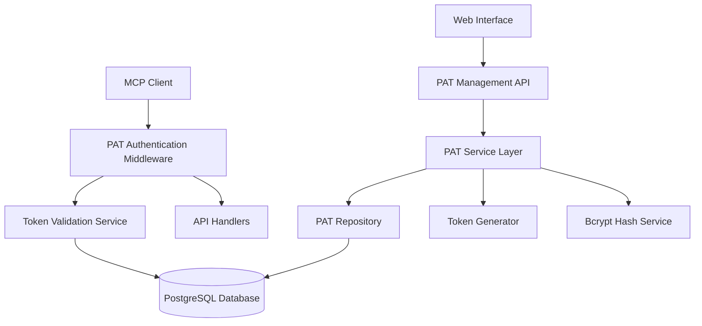
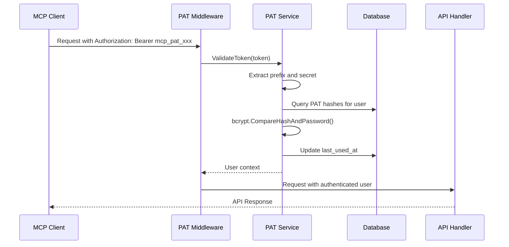
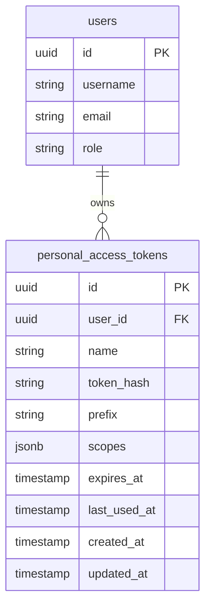

# Personal Access Token (PAT) Design Document

## Overview

This document outlines the technical design for implementing Personal Access Token authentication in the Product Requirements Management System. The PAT system will provide secure, programmatic authentication for MCP clients and AI agents while maintaining compatibility with the existing JWT-based authentication system.

The design follows Go security best practices using standard library cryptographic functions and integrates seamlessly with the current Gin-based HTTP server architecture and GORM database layer.

## Architecture

### High-Level Architecture



### Authentication Flow



## Components and Interfaces

### 1. Database Schema

#### Personal Access Tokens Table
```sql
CREATE TABLE personal_access_tokens (
    id UUID PRIMARY KEY DEFAULT gen_random_uuid(),
    user_id UUID NOT NULL REFERENCES users(id) ON DELETE CASCADE,
    name VARCHAR(255) NOT NULL,
    token_hash VARCHAR(255) NOT NULL,
    prefix VARCHAR(20) NOT NULL DEFAULT 'mcp_pat_',
    scopes JSONB DEFAULT '["full_access"]',
    expires_at TIMESTAMP,
    last_used_at TIMESTAMP,
    created_at TIMESTAMP NOT NULL DEFAULT NOW(),
    updated_at TIMESTAMP NOT NULL DEFAULT NOW(),
    
    CONSTRAINT unique_user_token_name UNIQUE(user_id, name),
    INDEX idx_pat_user_id (user_id),
    INDEX idx_pat_prefix (prefix),
    INDEX idx_pat_expires_at (expires_at)
);
```

### 2. Go Models

#### PAT Model (internal/models/personal_access_token.go)
```go
type PersonalAccessToken struct {
    ID          string    `json:"id" gorm:"type:uuid;primary_key;default:gen_random_uuid()"`
    UserID      string    `json:"user_id" gorm:"type:uuid;not null;index"`
    Name        string    `json:"name" gorm:"size:255;not null"`
    TokenHash   string    `json:"-" gorm:"size:255;not null"` // Never serialize
    Prefix      string    `json:"prefix" gorm:"size:20;not null;default:'mcp_pat_'"`
    Scopes      datatypes.JSON `json:"scopes" gorm:"type:jsonb;default:'[\"full_access\"]'"`
    ExpiresAt   *time.Time `json:"expires_at"`
    LastUsedAt  *time.Time `json:"last_used_at"`
    CreatedAt   time.Time `json:"created_at"`
    UpdatedAt   time.Time `json:"updated_at"`
    
    // Associations
    User *User `json:"user,omitempty" gorm:"foreignKey:UserID"`
}

type PATCreateResponse struct {
    Token string `json:"token"` // Full token returned only once
    PAT   PersonalAccessToken `json:"pat"`
}
```

### 3. Service Layer

#### PAT Service Interface (internal/service/pat_service.go)
```go
type PATService interface {
    // Token Management
    CreatePAT(ctx context.Context, userID string, req CreatePATRequest) (*PATCreateResponse, error)
    ListUserPATs(ctx context.Context, userID string, limit, offset int) (*ListResponse[PersonalAccessToken], error)
    GetPAT(ctx context.Context, patID, userID string) (*PersonalAccessToken, error)
    RevokePAT(ctx context.Context, patID, userID string) error
    
    // Authentication
    ValidateToken(ctx context.Context, token string) (*User, error)
    UpdateLastUsed(ctx context.Context, patID string) error
    
    // Maintenance
    CleanupExpiredTokens(ctx context.Context) (int, error)
}

type CreatePATRequest struct {
    Name      string     `json:"name" binding:"required,min=1,max=255"`
    ExpiresAt *time.Time `json:"expires_at"`
    Scopes    []string   `json:"scopes"`
}
```

#### Token Generator (internal/service/token_generator.go)
```go
type TokenGenerator interface {
    GenerateToken(prefix string, secretBytes int) (fullToken, secretPart string, error)
}

type SecureTokenGenerator struct{}

func (g *SecureTokenGenerator) GenerateToken(prefix string, secretBytes int) (string, string, error) {
    secretData := make([]byte, secretBytes)
    if _, err := rand.Read(secretData); err != nil {
        return "", "", fmt.Errorf("failed to generate random bytes: %w", err)
    }
    
    secretPart := base64.URLEncoding.WithPadding(base64.NoPadding).EncodeToString(secretData)
    fullToken := prefix + secretPart
    
    return fullToken, secretPart, nil
}
```

### 4. Repository Layer

#### PAT Repository (internal/repository/pat_repository.go)
```go
type PATRepository interface {
    Create(ctx context.Context, pat *PersonalAccessToken) error
    GetByID(ctx context.Context, id string) (*PersonalAccessToken, error)
    GetByUserID(ctx context.Context, userID string, limit, offset int) ([]*PersonalAccessToken, int64, error)
    GetHashesByPrefix(ctx context.Context, prefix string) ([]*PersonalAccessToken, error)
    UpdateLastUsed(ctx context.Context, id string, timestamp time.Time) error
    Delete(ctx context.Context, id string) error
    DeleteExpired(ctx context.Context) (int64, error)
}
```

### 5. HTTP Handlers

#### PAT Handler (internal/handlers/pat_handler.go)
```go
type PATHandler struct {
    patService service.PATService
    logger     *logrus.Logger
}

// POST /api/v1/pats
func (h *PATHandler) CreatePAT(c *gin.Context) {
    var req CreatePATRequest
    if err := c.ShouldBindJSON(&req); err != nil {
        c.JSON(400, gin.H{"error": "Invalid request"})
        return
    }
    
    userID := c.GetString("user_id")
    response, err := h.patService.CreatePAT(c.Request.Context(), userID, req)
    if err != nil {
        c.JSON(500, gin.H{"error": err.Error()})
        return
    }
    
    c.JSON(201, response)
}

// GET /api/v1/pats
func (h *PATHandler) ListPATs(c *gin.Context) { /* ... */ }

// DELETE /api/v1/pats/:id
func (h *PATHandler) RevokePAT(c *gin.Context) { /* ... */ }
```

### 6. Authentication Middleware

#### PAT Middleware (internal/auth/pat_middleware.go)
```go
func PATAuthMiddleware(patService service.PATService) gin.HandlerFunc {
    return func(c *gin.Context) {
        authHeader := c.GetHeader("Authorization")
        if authHeader == "" {
            c.JSON(401, gin.H{"error": "Authorization header required"})
            c.Abort()
            return
        }
        
        // Check for Bearer token
        parts := strings.SplitN(authHeader, " ", 2)
        if len(parts) != 2 || parts[0] != "Bearer" {
            c.JSON(401, gin.H{"error": "Invalid authorization format"})
            c.Abort()
            return
        }
        
        token := parts[1]
        
        // Try PAT authentication first
        if strings.HasPrefix(token, "mcp_pat_") {
            user, err := patService.ValidateToken(c.Request.Context(), token)
            if err != nil {
                c.JSON(401, gin.H{"error": "Invalid token"})
                c.Abort()
                return
            }
            
            // Set user context
            c.Set("user_id", user.ID)
            c.Set("user", user)
            c.Set("auth_method", "pat")
            c.Next()
            return
        }
        
        // Fall back to JWT authentication
        // ... existing JWT logic
    }
}
```

## Data Models

### Token Structure
- **Prefix**: `mcp_pat_` (8 characters)
- **Secret**: 43 characters (32 bytes base64url encoded)
- **Total Length**: 51 characters
- **Example**: `mcp_pat_K7gNU3sdo-OL0wNhqoVWhr3g6s1xYv72ol_pe_Unols`

### Database Relationships


### Scopes System (Future Extension)
```json
{
  "scopes": [
    "full_access",     // Complete API access (initial implementation)
    "read_only",       // Read-only access (future)
    "epics:read",      // Entity-specific permissions (future)
    "epics:write",
    "requirements:read",
    "requirements:write"
  ]
}
```

## Error Handling

### Error Types
```go
var (
    ErrInvalidToken     = errors.New("invalid token format")
    ErrTokenExpired     = errors.New("token has expired")
    ErrTokenNotFound    = errors.New("token not found")
    ErrTokenRevoked     = errors.New("token has been revoked")
    ErrDuplicateName    = errors.New("token name already exists")
    ErrInvalidScopes    = errors.New("invalid scopes specified")
)
```

### HTTP Error Responses
```go
type ErrorResponse struct {
    Error struct {
        Code    string `json:"code"`
        Message string `json:"message"`
    } `json:"error"`
}

// Example responses:
// 400 Bad Request - Validation errors
// 401 Unauthorized - Invalid/expired token
// 403 Forbidden - Insufficient scopes (future)
// 409 Conflict - Duplicate token name
// 500 Internal Server Error - System errors
```

## Testing Strategy

### Unit Tests
- **Token Generation**: Verify cryptographic randomness and format
- **Hash Validation**: Test bcrypt hashing and comparison
- **Service Logic**: Mock repository interactions
- **Middleware**: Test authentication flow with various token formats

### Integration Tests
- **Database Operations**: Test PAT CRUD operations with PostgreSQL
- **API Endpoints**: Test complete request/response cycles
- **Authentication Flow**: End-to-end token validation

### Security Tests
- **Token Entropy**: Verify sufficient randomness in generated tokens
- **Hash Security**: Validate bcrypt cost factors and salt generation
- **Timing Attacks**: Ensure constant-time token comparison
- **Rate Limiting**: Test protection against brute force attacks

### Test Data Setup
```go
func setupTestPAT(t *testing.T, db *gorm.DB, userID string) *PersonalAccessToken {
    pat := &PersonalAccessToken{
        UserID:    userID,
        Name:      "Test Token",
        TokenHash: "$2a$12$...", // bcrypt hash of test token
        Prefix:    "mcp_pat_",
        Scopes:    datatypes.JSON(`["full_access"]`),
    }
    require.NoError(t, db.Create(pat).Error)
    return pat
}
```

## Security Considerations

### Token Security
1. **Generation**: Use `crypto/rand` for cryptographically secure randomness
2. **Storage**: Store only bcrypt hashes, never plaintext tokens
3. **Transmission**: Require HTTPS for all token-bearing requests
4. **Logging**: Never log actual token values, only prefixes or IDs

### Authentication Security
1. **Constant Time**: Use `bcrypt.CompareHashAndPassword` for timing-safe comparison
2. **Rate Limiting**: Implement rate limiting on authentication endpoints
3. **Monitoring**: Log authentication attempts and failures
4. **Expiration**: Enforce token expiration and cleanup

### Database Security
1. **Indexes**: Optimize for lookup performance without exposing patterns
2. **Constraints**: Enforce unique token names per user
3. **Cascading**: Properly handle user deletion scenarios
4. **Backup**: Ensure token hashes are included in secure backups

## Performance Considerations

### Database Optimization
- Index on `user_id` for fast user token lookups
- Index on `prefix` for authentication queries
- Index on `expires_at` for cleanup operations
- Composite index on `(user_id, name)` for uniqueness

### Caching Strategy
- Cache user information after successful PAT validation
- Implement negative caching for invalid tokens (with short TTL)
- Cache scope permissions for performance (future enhancement)

### Cleanup Operations
- Scheduled job to remove expired tokens
- Batch operations for bulk token management
- Soft deletion option for audit trails (future enhancement)

## Migration Strategy

### Database Migration
```sql
-- Migration: 000005_add_personal_access_tokens.up.sql
CREATE TABLE personal_access_tokens (
    id UUID PRIMARY KEY DEFAULT gen_random_uuid(),
    user_id UUID NOT NULL REFERENCES users(id) ON DELETE CASCADE,
    name VARCHAR(255) NOT NULL,
    token_hash VARCHAR(255) NOT NULL,
    prefix VARCHAR(20) NOT NULL DEFAULT 'mcp_pat_',
    scopes JSONB DEFAULT '["full_access"]',
    expires_at TIMESTAMP,
    last_used_at TIMESTAMP,
    created_at TIMESTAMP NOT NULL DEFAULT NOW(),
    updated_at TIMESTAMP NOT NULL DEFAULT NOW(),
    
    CONSTRAINT unique_user_token_name UNIQUE(user_id, name)
);

CREATE INDEX idx_pat_user_id ON personal_access_tokens(user_id);
CREATE INDEX idx_pat_prefix ON personal_access_tokens(prefix);
CREATE INDEX idx_pat_expires_at ON personal_access_tokens(expires_at);
```

### Backward Compatibility
- Existing JWT authentication continues to work unchanged
- PAT authentication is additive, not replacing JWT
- API endpoints maintain existing authentication requirements
- No breaking changes to existing client implementations

## Future Enhancements

### Scope-Based Permissions
- Implement granular permission system
- Entity-level access control (epics, requirements, etc.)
- Operation-level permissions (read, write, delete)
- Role-based scope templates

### Advanced Features
- Token rotation and refresh capabilities
- Audit logging for token usage
- Token usage analytics and reporting
- Integration with external identity providers
- Multi-factor authentication for token creation

### Monitoring and Alerting
- Token usage metrics and dashboards
- Suspicious activity detection
- Automated token lifecycle management
- Integration with security monitoring systems