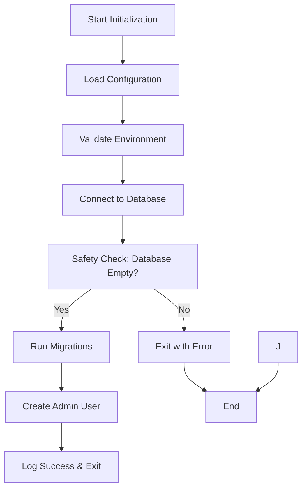

# Design Document

## Overview

The production initialization service is a standalone binary that safely sets up fresh installations of the product requirements management system. It performs environment validation, database setup, migrations, role creation, and admin user creation with comprehensive safety checks to prevent execution on existing installations.

The service follows the existing project patterns and integrates with the current configuration, database, authentication, and logging systems. It provides a secure, idempotent initialization process suitable for production deployments.

## Architecture

### High-Level Flow



### Safety-First Design

The service implements multiple safety layers:
1. **Environment Validation**: Ensures all required configuration is present
2. **Database Connectivity**: Verifies database is accessible before proceeding
3. **Data Existence Checks**: Prevents execution on non-empty databases
4. **Atomic Operations**: Uses database transactions for consistency
5. **Comprehensive Logging**: Provides detailed status and error information

## Components and Interfaces

### 1. Main Entry Point (`cmd/init/main.go`)

**Responsibilities:**
- Parse command-line flags and environment variables
- Orchestrate the initialization process
- Handle top-level error reporting and exit codes

**Key Functions:**
```go
func main()
func validateFlags() error
func runInitialization(cfg *config.Config) error
```

### 2. Initialization Service (`internal/init/service.go`)

**Responsibilities:**
- Coordinate all initialization steps
- Implement safety checks and validation
- Manage database transactions and rollback

**Key Functions:**
```go
type InitService struct {
    cfg    *config.Config
    db     *gorm.DB
    logger *logrus.Logger
    auth   *auth.Service
}

func NewInitService(cfg *config.Config) (*InitService, error)
func (s *InitService) Initialize() error
func (s *InitService) validateEnvironment() error
func (s *InitService) checkDatabaseEmpty() error
func (s *InitService) runMigrations() error
func (s *InitService) createAdminUser() error
```

### 3. Database Safety Checker (`internal/init/safety.go`)

**Responsibilities:**
- Verify database is empty before initialization
- Check for existing data in critical tables
- Provide detailed reporting of found data

**Key Functions:**
```go
type SafetyChecker struct {
    db *gorm.DB
}

func NewSafetyChecker(db *gorm.DB) *SafetyChecker
func (sc *SafetyChecker) IsDatabaseEmpty() (bool, error)
func (sc *SafetyChecker) GetDataSummary() (*DataSummary, error)
```

### 4. Admin User Creator (`internal/init/admin.go`)

**Responsibilities:**
- Create the default admin user
- Handle password generation and hashing
- Assign administrator role

**Key Functions:**
```go
type AdminCreator struct {
    db   *gorm.DB
    auth *auth.Service
}

func NewAdminCreator(db *gorm.DB, auth *auth.Service) *AdminCreator
func (ac *AdminCreator) CreateAdminUser(password string) (*models.User, error)
func (ac *AdminCreator) generateSecurePassword() string
```

## Data Models

### Configuration Extensions

The service uses the existing configuration system with additional validation for initialization-specific requirements:

```go
type InitConfig struct {
    AdminPassword string // From DEFAULT_ADMIN_PASSWORD env var
    DryRun        bool   // For testing without actual changes
}
```

### Safety Check Results

```go
type DataSummary struct {
    UserCount               int64
    EpicCount              int64
    UserStoryCount         int64
    RequirementCount       int64
    AcceptanceCriteriaCount int64
    CommentCount           int64
    IsEmpty                bool
    NonEmptyTables         []string
}
```

### User Role Assignment

The service assigns the Administrator role to the created admin user using the existing role constants:

```go
// From internal/models/user.go
const (
    RoleAdministrator UserRole = "Administrator" // Full system access
    RoleUser          UserRole = "User"          // Standard user permissions  
    RoleCommenter     UserRole = "Commenter"     // Comment-only permissions
)
```

## Error Handling

### Error Categories

1. **Configuration Errors**: Missing or invalid environment variables
2. **Database Errors**: Connection failures, migration errors
3. **Safety Errors**: Database not empty, existing data found
4. **Creation Errors**: User creation failures
5. **System Errors**: Unexpected failures, resource constraints

### Error Response Strategy

```go
type InitError struct {
    Type    ErrorType
    Message string
    Cause   error
    Context map[string]interface{}
}

type ErrorType string

const (
    ErrorTypeConfig   ErrorType = "configuration"
    ErrorTypeDatabase ErrorType = "database" 
    ErrorTypeSafety   ErrorType = "safety"
    ErrorTypeCreation ErrorType = "creation"
    ErrorTypeSystem   ErrorType = "system"
)
```

### Exit Codes

- `0`: Success
- `1`: Configuration error
- `2`: Database connection error
- `3`: Safety check failed (database not empty)
- `4`: Migration error
- `5`: User creation error
- `10`: System error

## Testing Strategy

### Unit Tests

1. **Configuration Validation Tests**
   - Test environment variable validation
   - Test missing required variables
   - Test invalid configuration values

2. **Safety Checker Tests**
   - Test empty database detection
   - Test non-empty database detection
   - Test data summary generation

3. **Admin Creator Tests**
   - Test admin user creation
   - Test password hashing
   - Test role assignment

### Integration Tests

1. **Full Initialization Flow**
   - Test complete initialization on empty database
   - Test safety prevention on non-empty database
   - Test rollback on partial failure

2. **Database Integration**
   - Test with PostgreSQL testcontainers
   - Test migration execution
   - Test data persistence

### End-to-End Tests

1. **Production Simulation**
   - Test with production-like configuration
   - Test with various database states
   - Test error scenarios and recovery

## Security Considerations

### Password Security

1. **Environment Variable**: Admin password must be provided via `DEFAULT_ADMIN_PASSWORD`
2. **Secure Generation**: If no password provided, then system should exit with error message
3. **Hashing**: Use bcrypt with appropriate cost factor
4. **Logging**: Never log passwords in plain text

### Database Security

1. **Connection Security**: Use SSL/TLS for database connections in production
2. **Privilege Validation**: Verify database user has required permissions
3. **Transaction Safety**: Use database transactions for atomic operations

### Access Control

1. **Role Assignment**: Assign Administrator role to default admin user
2. **Permission Validation**: Ensure admin user has full system access
3. **Default Security**: Secure defaults for all configuration

### Resource Usage

1. **Memory Management**: Minimize memory footprint during initialization
2. **Connection Pooling**: Use single database connection for initialization
3. **Cleanup**: Proper resource cleanup on success and failure

## Monitoring and Observability

### Logging Strategy

1. **Structured Logging**: Use JSON format for production environments
2. **Progress Tracking**: Log each major step with timing information
3. **Error Context**: Include relevant context in error messages
4. **Security Logging**: Log security-relevant events (user creation, role assignment)

## Deployment Integration

### Build Integration

The service integrates with the existing Makefile:

```makefile
# Add to existing Makefile
build-init: ## Build initialization binary
	go build -o bin/init cmd/init/main.go

init: build-init ## Run initialization service
	./bin/init

.PHONY: build-init init
```

### Docker Integration

The service can be containerized for deployment:

```dockerfile
# Multi-stage build for initialization
FROM golang:1.24.5-alpine AS init-builder
WORKDIR /app
COPY . .
RUN go build -o bin/init cmd/init/main.go

FROM alpine:latest AS init
RUN apk --no-cache add ca-certificates
WORKDIR /root/
COPY --from=init-builder /app/bin/init .
COPY --from=init-builder /app/migrations ./migrations
CMD ["./init"]
```

### Environment Configuration

Production deployment requires these environment variables:

```bash
# Database Configuration
DB_HOST=production-db-host
DB_PORT=5432
DB_USER=app_user
DB_PASSWORD=secure_password
DB_NAME=requirements_db
DB_SSLMODE=require

# Redis Configuration (for main app)
REDIS_HOST=production-redis-host
REDIS_PORT=6379
REDIS_PASSWORD=redis_password

# JWT Configuration
JWT_SECRET=production-jwt-secret

# Initialization Configuration
DEFAULT_ADMIN_PASSWORD=secure_admin_password

# Logging Configuration
LOG_LEVEL=info
LOG_FORMAT=json
```

## Migration from Development

### Development to Production

1. **Configuration Review**: Ensure all production environment variables are set
2. **Database Preparation**: Ensure target database is empty and accessible
3. **Security Validation**: Verify SSL/TLS configuration and credentials

### Validation Steps

1. **Pre-initialization**: Verify environment and connectivity
2. **Post-initialization**: Verify admin user can authenticate
3. **Functional Testing**: Verify basic application functionality
4. **Security Testing**: Verify role-based access control works correctly