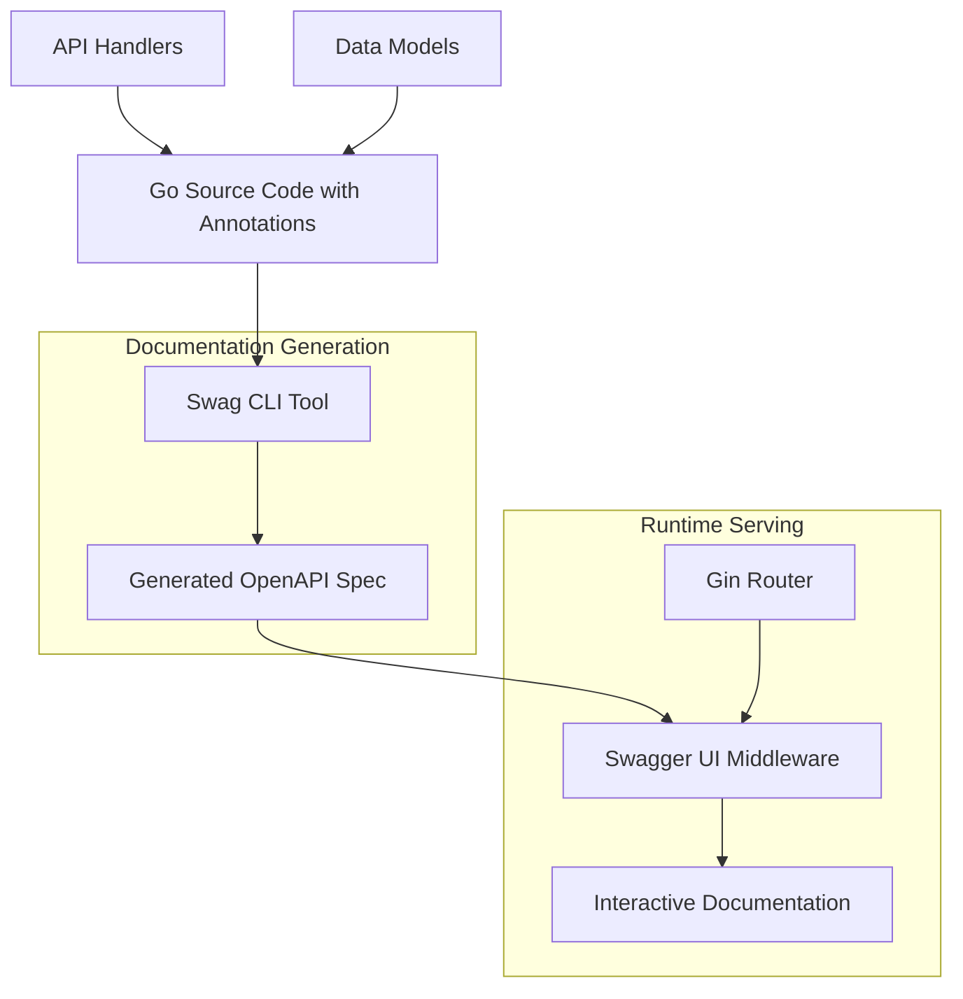

# Design Document

## Overview

This design document outlines the implementation of comprehensive Swagger/OpenAPI 3.0 documentation for the Product Requirements Management API. The solution will integrate with the existing Gin-based Go application to provide auto-generated, interactive API documentation that stays synchronized with the codebase.

The implementation will use `swaggo/swag` for automatic OpenAPI specification generation from Go code annotations and `swaggo/gin-swagger` for serving the Swagger UI interface. This approach ensures documentation remains accurate and up-to-date with minimal manual maintenance.

## Architecture

### Component Overview



### Integration Points

1. **Code Annotations**: Swagger comments in handler functions and model structs
2. **Build Process**: Swag CLI integration for spec generation
3. **Runtime Serving**: Gin middleware for serving Swagger UI
4. **Route Registration**: Documentation endpoint registration in the router

## Components and Interfaces

### 1. Swagger Generation Tool Integration

**Component**: `swaggo/swag` CLI tool
- **Purpose**: Parse Go source code annotations and generate OpenAPI 3.0 specification
- **Input**: Go source files with Swagger annotations
- **Output**: `docs/swagger.json` and `docs/swagger.yaml` files
- **Integration**: Build-time code generation

### 2. Swagger UI Middleware

**Component**: `swaggo/gin-swagger` middleware
- **Purpose**: Serve interactive Swagger UI and OpenAPI specification
- **Dependencies**: Generated documentation files
- **Endpoints**: 
  - `/swagger/index.html` - Swagger UI interface
  - `/swagger/doc.json` - OpenAPI JSON specification
  - `/swagger/swagger.yaml` - OpenAPI YAML specification

### 3. Documentation Annotations System

**Component**: Structured comment annotations in Go code
- **Handler Annotations**: Endpoint documentation with parameters, responses, examples
- **Model Annotations**: Data structure documentation with field descriptions and validation rules
- **Security Annotations**: Authentication and authorization documentation

### 4. Documentation Route Handler

**Component**: Custom documentation routes and metadata
- **Purpose**: Provide additional documentation endpoints and API metadata
- **Features**: API versioning info, health check documentation, custom examples

## Data Models

### OpenAPI Specification Structure

```yaml
openapi: 3.0.0
info:
  title: Product Requirements Management API
  version: 1.0.0
  description: API for managing product requirements through hierarchical structure
  contact:
    name: API Support
  license:
    name: MIT
servers:
  - url: http://localhost:8080
    description: Development server
paths:
  # Generated from handler annotations
components:
  schemas:
    # Generated from model annotations
  securitySchemes:
    # JWT authentication scheme
```

### Core Entity Schemas

The following Go structs will be documented with Swagger annotations:

1. **Epic** - Top-level feature containers
2. **UserStory** - Feature requirements within epics
3. **AcceptanceCriteria** - Testable conditions for user stories
4. **Requirement** - Detailed technical requirements
5. **Comment** - Discussion and feedback system
6. **RequirementRelationship** - Inter-requirement dependencies
7. **User** - System users and assignees

### Request/Response Models

Standardized request and response structures:

```go
// Standard API Response wrapper
type APIResponse struct {
    Data    interface{} `json:"data,omitempty"`
    Message string      `json:"message,omitempty"`
    Error   *ErrorDetail `json:"error,omitempty"`
}

// Error response structure
type ErrorDetail struct {
    Code    string `json:"code"`
    Message string `json:"message"`
    Details string `json:"details,omitempty"`
}

// Pagination metadata
type PaginationMeta struct {
    Limit  int `json:"limit"`
    Offset int `json:"offset"`
    Total  int `json:"total"`
}
```

## Error Handling

### Error Documentation Strategy

1. **Standard HTTP Status Codes**: Document all possible HTTP status codes for each endpoint
2. **Error Response Schema**: Consistent error response format across all endpoints
3. **Error Code Catalog**: Comprehensive list of application-specific error codes
4. **Example Error Responses**: Real-world error examples for common scenarios

### Error Response Categories

- **400 Bad Request**: Validation errors, malformed requests
- **401 Unauthorized**: Authentication failures
- **403 Forbidden**: Authorization failures
- **404 Not Found**: Resource not found errors
- **409 Conflict**: Business logic conflicts (e.g., dependencies exist)
- **500 Internal Server Error**: System errors

## Testing Strategy

### Documentation Testing Approach

1. **Annotation Validation**: Ensure all public endpoints have proper Swagger annotations
2. **Schema Validation**: Validate generated OpenAPI specification against OpenAPI 3.0 schema
3. **Example Testing**: Verify that documented examples are valid and current
4. **UI Accessibility**: Test Swagger UI functionality and responsiveness
5. **Integration Testing**: Validate documentation accuracy against actual API behavior

### Automated Testing Components

```go
// Test to ensure all handlers have Swagger annotations
func TestSwaggerAnnotationCoverage(t *testing.T) {
    // Scan handler files for missing @Summary annotations
}

// Test to validate generated OpenAPI spec
func TestOpenAPISpecValidation(t *testing.T) {
    // Load and validate swagger.json against OpenAPI 3.0 schema
}

// Test to verify example requests/responses
func TestDocumentationExamples(t *testing.T) {
    // Execute documented examples against actual API
}
```

### Documentation Quality Metrics

- **Annotation Coverage**: Percentage of endpoints with complete documentation
- **Schema Completeness**: All request/response models documented
- **Example Accuracy**: Examples match actual API behavior
- **UI Functionality**: Swagger UI interactive features work correctly

## Implementation Details

### File Structure

```
├── docs/                          # Generated documentation
│   ├── docs.go                   # Generated Go documentation
│   ├── swagger.json              # OpenAPI JSON specification
│   └── swagger.yaml              # OpenAPI YAML specification
├── internal/
│   ├── handlers/                 # API handlers with Swagger annotations
│   ├── models/                   # Data models with field documentation
│   └── docs/                     # Documentation utilities
│       ├── swagger.go            # Swagger configuration
│       ├── examples.go           # Request/response examples
│       └── schemas.go            # Additional schema definitions
└── cmd/
    └── swagger/                  # Documentation generation tools
        └── main.go               # Swagger generation utility
```

### Annotation Standards

#### Handler Annotation Template

```go
// CreateEpic creates a new epic
// @Summary Create a new epic
// @Description Create a new epic with the provided details
// @Tags epics
// @Accept json
// @Produce json
// @Param epic body service.CreateEpicRequest true "Epic creation request"
// @Success 201 {object} models.Epic "Successfully created epic"
// @Failure 400 {object} ErrorResponse "Invalid request"
// @Failure 500 {object} ErrorResponse "Internal server error"
// @Router /api/v1/epics [post]
func (h *EpicHandler) CreateEpic(c *gin.Context) {
    // Implementation
}
```

#### Model Annotation Template

```go
// Epic represents a high-level feature or initiative
type Epic struct {
    ID          uuid.UUID    `json:"id" gorm:"type:uuid;primary_key" example:"123e4567-e89b-12d3-a456-426614174000"`
    ReferenceID string       `json:"reference_id" gorm:"uniqueIndex;not null" example:"EP-001"`
    Title       string       `json:"title" gorm:"not null" validate:"required,max=500" example:"User Authentication System"`
    Description *string      `json:"description,omitempty" example:"Implement comprehensive user authentication and authorization system"`
    Priority    Priority     `json:"priority" gorm:"not null" validate:"required,min=1,max=4" example:"1"`
    Status      EpicStatus   `json:"status" gorm:"not null" example:"backlog"`
    CreatedAt   time.Time    `json:"created_at" example:"2023-01-01T00:00:00Z"`
    UpdatedAt   time.Time    `json:"updated_at" example:"2023-01-01T00:00:00Z"`
}
```

### Build Integration

#### Makefile Integration

```makefile
# Generate Swagger documentation
.PHONY: swagger
swagger:
	swag init -g cmd/server/main.go -o docs --parseDependency --parseInternal

# Format Swagger annotations
.PHONY: swagger-fmt
swagger-fmt:
	swag fmt

# Validate Swagger documentation
.PHONY: swagger-validate
swagger-validate:
	swagger-codegen validate -i docs/swagger.yaml
```

#### CI/CD Integration

```yaml
# GitHub Actions workflow step
- name: Generate and validate Swagger docs
  run: |
    go install github.com/swaggo/swag/cmd/swag@latest
    make swagger
    make swagger-validate
```

### Security Documentation

#### Authentication Scheme Definition

```go
// @securityDefinitions.apikey BearerAuth
// @in header
// @name Authorization
// @description JWT token authentication. Format: "Bearer {token}"
```

#### Endpoint Security Annotation

```go
// @Security BearerAuth
// @Router /api/v1/epics [post]
```

### Performance Considerations

1. **Static Generation**: Documentation generated at build time, not runtime
2. **Caching**: Swagger UI assets served with appropriate cache headers
3. **Conditional Serving**: Documentation only served in development/staging environments if needed
4. **Lazy Loading**: Swagger UI loads specification on demand

### Deployment Strategy

1. **Development**: Full Swagger UI with all features enabled
2. **Staging**: Complete documentation for testing and validation
3. **Production**: Configurable documentation serving (can be disabled for security)
4. **Documentation Site**: Separate static documentation site for public API consumers

## Configuration Options

### Environment-Based Configuration

```go
type SwaggerConfig struct {
    Enabled     bool   `env:"SWAGGER_ENABLED" default:"true"`
    BasePath    string `env:"SWAGGER_BASE_PATH" default:"/swagger"`
    Title       string `env:"SWAGGER_TITLE" default:"Product Requirements Management API"`
    Version     string `env:"SWAGGER_VERSION" default:"1.0.0"`
    Description string `env:"SWAGGER_DESCRIPTION"`
}
```

### Runtime Configuration

- **Enable/Disable**: Toggle documentation serving
- **Custom Branding**: API title, description, contact information
- **Server URLs**: Multiple environment server configurations
- **Authentication**: Configure security schemes and requirements