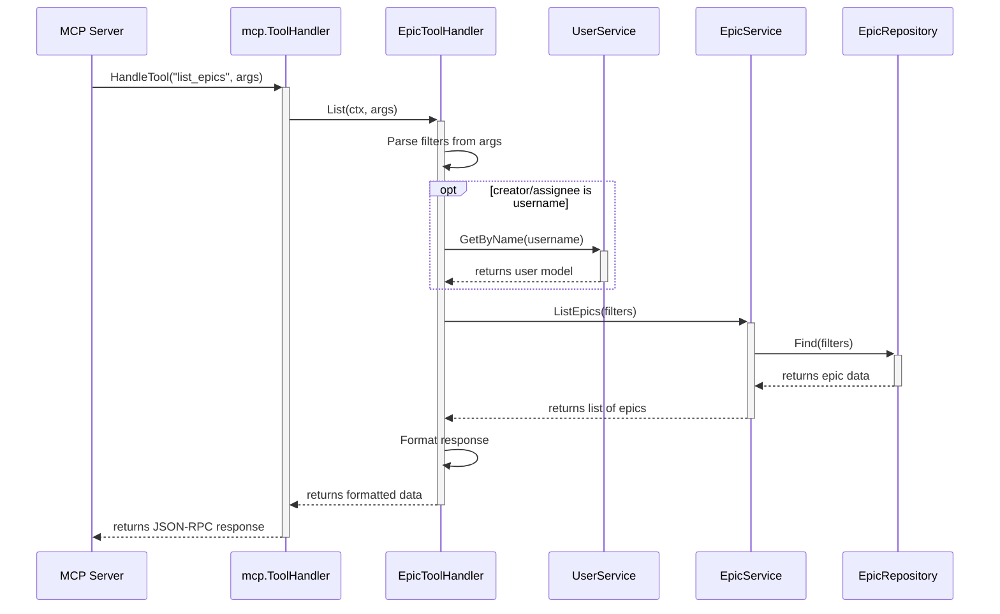

### Диаграмма взаимодействия для MCP Epic Tool

Эта диаграмма иллюстрирует последовательность вызовов при выполнении `list_epics` через MCP (Mission Control Plane).

```mermaid
sequenceDiagram
    participant MCP as MCP Server
    participant Router as mcp.ToolHandler
    participant Handler as EpicToolHandler
    participant UService as UserService
    participant EService as EpicService
    participant Repo as EpicRepository

    MCP->>+Router: HandleTool("list_epics", args)
    Router->>+Handler: List(ctx, args)
    Handler->>Handler: Parse filters from args
    
    opt creator/assignee is username
        Handler->>+UService: GetByName(username)
        UService-->>-Handler: returns user model
    end

    Handler->>+EService: ListEpics(filters)
    EService->>+Repo: Find(filters)
    Repo-->>-EService: returns epic data
    EService-->>-Handler: returns list of epics

    Handler->>Handler: Format response
    Handler-->>-Router: returns formatted data
    Router-->>-MCP: returns JSON-RPC response
```
